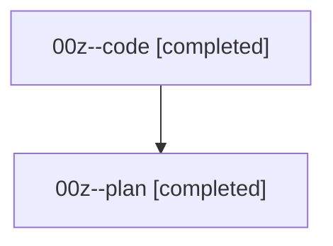

# Family: 00z

[Agent Hoods](../README.md) / [bbugyi200](../users/bbugyi200/README.md) / [athena](../users/bbugyi200/machines/athena/README.md) / [00z](../users/bbugyi200/machines/athena/hoods/00z/README.md) / 00z

Owner: `bbugyi200.athena` · Hood: `00z` · Members: 2

## Lineage

The diagram is an optional enhancement; the ordered table below contains the same lineage in accessible text.

| Role | Agent | State | Model / provider | Timing | Commits | Prompt | Chat |
|---|---|---|---|---|---:|---|---|
| code | 00z--code | completed | gpt-5.5 / codex | 2026-08-14T13:30:12.264725+00:00 | 0 | — | [Chat](../agents/bbugyi200.athena.00z--code/chat.md) |
| plan | 00z--plan | completed | opus / claude | 2026-08-14T13:25:03.646554+00:00 | 0 | [Prompt](../agents/bbugyi200.athena.00z--plan/prompt.md) | [Chat](../agents/bbugyi200.athena.00z--plan/chat.md) |

## Neighbors

| Agent | Relation | State |
|---|---|---|
| [00z.cld](../agents/bbugyi200.athena.00z.cld/README.md) | descendant | completed |
| [00z.cld.f1](../agents/bbugyi200.athena.00z.cld.f1/README.md) | descendant | completed |
| [00z.f0](bbugyi200.athena.00z.f0.md) (family · 2) | descendant | completed 2 |
| [00z.f0.f0](bbugyi200.athena.00z.f0.f0.md) (family · 2) | descendant | active 2 |
