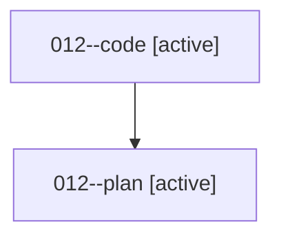

# Family: 012

[Agent Hoods](../README.md) / [bbugyi200](../users/bbugyi200/README.md) / [athena](../users/bbugyi200/machines/athena/README.md) / [012](../users/bbugyi200/machines/athena/hoods/012/README.md) / 012

Owner: `bbugyi200.athena` · Hood: `012` · Members: 2

## Lineage

The diagram is an optional enhancement; the ordered table below contains the same lineage in accessible text.

| Role | Agent | State | Model / provider | Timing | Commits | Prompt | Chat |
|---|---|---|---|---|---:|---|---|
| code | 012--code | active | sonnet / claude | 2026-08-14T14:20:46.271365+00:00 | 0 | — | — |
| plan | 012--plan | active | opus / claude | 2026-08-14T14:06:56.838084+00:00 | 0 | [Prompt](../agents/bbugyi200.athena.012--plan/prompt.md) | [Chat](../agents/bbugyi200.athena.012--plan/chat.md) |
