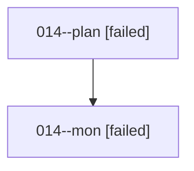

# Family: 014

[Agent Hoods](../README.md) / [bbugyi200](../users/bbugyi200/README.md) / [athena](../users/bbugyi200/machines/athena/README.md) / [014](../users/bbugyi200/machines/athena/hoods/014/README.md) / 014

Owner: `bbugyi200.athena` · Hood: `014` · Members: 2

## Lineage

The diagram is an optional enhancement; the ordered table below contains the same lineage in accessible text.

| Role | Agent | State | Model / provider | Timing | Commits | Prompt | Chat |
|---|---|---|---|---|---:|---|---|
| plan | 014--plan | failed | opus / claude | 2026-08-14T14:38:47.585475+00:00 | 0 | [Prompt](../agents/bbugyi200.athena.014--plan/prompt.md) | [Chat](../agents/bbugyi200.athena.014--plan/chat.md) |
| mon | 014--mon | failed | opus / claude | 2026-08-14T14:49:14.045714+00:00 | 0 | — | [Chat](../agents/bbugyi200.athena.014--mon/chat.md) |

## Commits

| Role | Repo | Commit | Subject | Committed |
|---|---|---|---|---|
| — | sase | [`e2fcc1d`](https://github.com/sase-org/sase/commit/e2fcc1d60634ed6287e2588c9eea33f4c4c6e0f2) | chore: Add SDD prompt and plan for fork\_implies\_wait | 2026-06-19 13:50:33 UTC |
| — | sase | [`e64a9eb`](https://github.com/sase-org/sase/commit/e64a9ebf1ce354e1cd039a61239e38f547ac123f) | feat(fork): make \`#fork:\<name\>\` imply \`%w:\<name\>\` | 2026-06-19 14:11:37 UTC |

## Neighbors

| Agent | Relation | State |
|---|---|---|
| [014.f1](../agents/bbugyi200.athena.014.f1/README.md) | descendant | completed |
