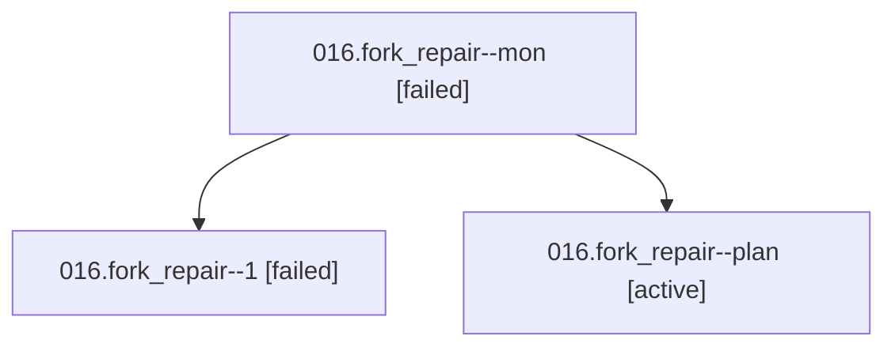

# Family: 016.fork\_repair

[Agent Hoods](../README.md) / [bbugyi200](../users/bbugyi200/README.md) / [athena](../users/bbugyi200/machines/athena/README.md) / [016](../users/bbugyi200/machines/athena/hoods/016/README.md) / 016.fork\_repair

Owner: `bbugyi200.athena` · Hood: `016` · Members: 3

## Lineage

The diagram is an optional enhancement; the ordered table below contains the same lineage in accessible text.

| Role | Agent | State | Model / provider | Timing | Commits | Prompt | Chat |
|---|---|---|---|---|---:|---|---|
| mon | 016.fork\_repair--mon | failed | gpt-6-astra / codex | 2026-09-07T06:44:53.985183+00:00 → 2026-09-07T06:57:06.817806+00:00 | 0 | — | [Chat](../agents/bbugyi200.athena.016.fork_repair--mon/chat.md) |
| 1 | 016.fork\_repair--1 | failed | gpt-6-astra / codex | 2026-09-07T06:57:30.424494+00:00 → 2026-09-07T06:57:42.411389+00:00 | 0 | [Prompt](../agents/bbugyi200.athena.016.fork_repair--1/prompt.md) | — |
| plan | 016.fork\_repair--plan | active | gpt-6-astra / codex | 2026-09-07T06:30:31.165846+00:00 | 0 | [Prompt](../agents/bbugyi200.athena.016.fork_repair--plan/prompt.md) | [Chat](../agents/bbugyi200.athena.016.fork_repair--plan/chat.md) |

## Neighbors

| Agent | Relation | State |
|---|---|---|
| [016](../agents/bbugyi200.athena.016/README.md) | ancestor | completed |
