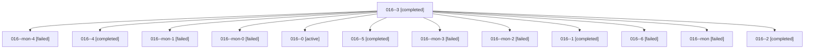

# Family: 016

[Agent Hoods](../README.md) / [bbugyi200](../users/bbugyi200/README.md) / [athena](../users/bbugyi200/machines/athena/README.md) / [016](../users/bbugyi200/machines/athena/hoods/016/README.md) / 016

Owner: `bbugyi200.athena` · Hood: `016` · Members: 13

## Lineage

The diagram is an optional enhancement; the ordered table below contains the same lineage in accessible text.

| Role | Agent | State | Model / provider | Timing | Commits | Prompt | Chat |
|---|---|---|---|---|---:|---|---|
| 3 | 016--3 | completed | gpt-6-astra / codex | 2026-09-07T03:39:25.993850+00:00 → 2026-09-07T03:56:54.672167+00:00 | 0 | [Prompt](../agents/bbugyi200.athena.016--3/prompt.md) | [Chat](../agents/bbugyi200.athena.016--3/chat.md) |
| mon-4 | 016--mon-4 | failed | gpt-6-astra / codex | 2026-09-07T06:29:44.278691+00:00 → 2026-09-07T07:32:14.020483+00:00 | 0 | — | [Chat](../agents/bbugyi200.athena.016--mon-4/chat.md) |
| 4 | 016--4 | completed | gpt-6-astra / codex | 2026-09-07T04:58:03.693701+00:00 → 2026-09-07T05:11:59.422712+00:00 | 0 | [Prompt](../agents/bbugyi200.athena.016--4/prompt.md) | [Chat](../agents/bbugyi200.athena.016--4/chat.md) |
| mon-1 | 016--mon-1 | failed | gpt-6-astra / codex | 2026-09-07T02:36:17.115879+00:00 → 2026-09-07T03:39:00.803755+00:00 | 0 | — | [Chat](../agents/bbugyi200.athena.016--mon-1/chat.md) |
| mon-0 | 016--mon-0 | failed | gpt-6-astra / codex | 2026-09-07T02:24:23.249633+00:00 → 2026-09-07T02:27:04.179474+00:00 | 0 | — | [Chat](../agents/bbugyi200.athena.016--mon-0/chat.md) |
| 0 | 016--0 | active | claude-fable-5 / claude | 2026-09-07T01:48:45.581493+00:00 | 0 | [Prompt](../agents/bbugyi200.athena.016--0/prompt.md) | [Chat](../agents/bbugyi200.athena.016--0/chat.md) |
| 5 | 016--5 | completed | gpt-6-astra / codex | 2026-09-07T06:13:37.473553+00:00 → 2026-09-07T06:30:13.162334+00:00 | 0 | [Prompt](../agents/bbugyi200.athena.016--5/prompt.md) | [Chat](../agents/bbugyi200.athena.016--5/chat.md) |
| mon-3 | 016--mon-3 | failed | gpt-6-astra / codex | 2026-09-07T05:11:41.113493+00:00 → 2026-09-07T06:12:56.250779+00:00 | 0 | — | [Chat](../agents/bbugyi200.athena.016--mon-3/chat.md) |
| mon-2 | 016--mon-2 | failed | gpt-6-astra / codex | 2026-09-07T03:55:58.648439+00:00 → 2026-09-07T04:57:38.685066+00:00 | 0 | — | [Chat](../agents/bbugyi200.athena.016--mon-2/chat.md) |
| 1 | 016--1 | completed | gpt-6-astra / codex | 2026-09-07T02:04:08.857731+00:00 → 2026-09-07T02:25:19.109142+00:00 | 0 | [Prompt](../agents/bbugyi200.athena.016--1/prompt.md) | [Chat](../agents/bbugyi200.athena.016--1/chat.md) |
| 6 | 016--6 | failed | gpt-6-astra / codex | 2026-09-07T07:32:35.785182+00:00 → 2026-09-07T07:32:53.973660+00:00 | 0 | [Prompt](../agents/bbugyi200.athena.016--6/prompt.md) | — |
| mon | 016--mon | failed | claude-fable-5 / claude | 2026-09-07T02:01:31.133278+00:00 → 2026-09-07T02:03:46.143098+00:00 | 0 | — | [Chat](../agents/bbugyi200.athena.016--mon/chat.md) |
| 2 | 016--2 | completed | gpt-6-astra / codex | 2026-09-07T02:27:30.459205+00:00 → 2026-09-07T02:36:40.439110+00:00 | 0 | [Prompt](../agents/bbugyi200.athena.016--2/prompt.md) | [Chat](../agents/bbugyi200.athena.016--2/chat.md) |

## Commits

| Role | Repo | Commit | Subject | Committed |
|---|---|---|---|---|
| — | sase | [`f02a235`](https://github.com/sase-org/sase/commit/f02a235b52b14557642cd93551ba79bf94ef4ec0) | chore: Add SDD prompt and plan for confirmed\_bead\_display | 2026-06-19 10:11:44 EDT |
| — | sase | [`a4aff73`](https://github.com/sase-org/sase/commit/a4aff7337a142637a7069277de6aeed2e7211d0f) | feat(ace): show bead glyph and metadata only for confirmed beads | 2026-06-19 10:42:38 EDT |

## Neighbors

| Agent | Relation | State |
|---|---|---|
| [016.fork\_repair](bbugyi200.athena.016.fork_repair.md) (family · 3) | descendant | active 1, failed 2 |
