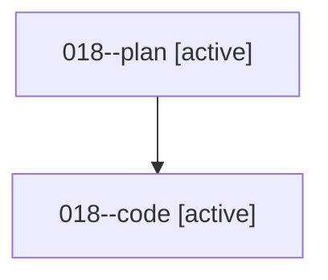

# Family: 018

[Agent Hoods](../README.md) / [bbugyi200](../users/bbugyi200/README.md) / [athena](../users/bbugyi200/machines/athena/README.md) / [018](../users/bbugyi200/machines/athena/hoods/018/README.md) / 018

Owner: `bbugyi200.athena` · Hood: `018` · Members: 2

## Lineage

The diagram is an optional enhancement; the ordered table below contains the same lineage in accessible text.

| Role | Agent | State | Model / provider | Timing | Commits | Prompt | Chat |
|---|---|---|---|---|---:|---|---|
| plan | 018--plan | active | opus / claude | 2026-08-14T15:17:16.861702+00:00 | 0 | [Prompt](../agents/bbugyi200.athena.018--plan/prompt.md) | [Chat](../agents/bbugyi200.athena.018--plan/chat.md) |
| code | 018--code | active | gpt-5.5 / codex | 2026-08-14T15:26:21.901240+00:00 | [1](../agents/bbugyi200.athena.018--code/README.md#commits) | — | — |

## Commits

| Role | Repo | Commit | Subject | Committed |
|---|---|---|---|---|
| — | sase | [`7bc665b`](https://github.com/sase-org/sase/commit/7bc665babd6c29c60159b42dc69d43daf70d66fa) | chore: Add SDD prompt and plan for init\_onboarding\_agents | 2026-06-19 14:42:52 UTC |
| — | sase | [`8062e6f`](https://github.com/sase-org/sase/commit/8062e6f1c71ab74344ad2f1f56dd74a94292ff47) | feat(init): repair AGENTS.md via onboarding title fallback | 2026-06-19 15:10:49 UTC |
| code | sase | [`08a69e3`](https://github.com/sase-org/sase/commit/08a69e3ec64ffcfe7460f054c183532340634613) | fix(monitor): keep follow-up prompt bodies literal | 2026-08-14 15:46:27 UTC |

## Neighbors

| Agent | Relation | State |
|---|---|---|
| [018.f1](../agents/bbugyi200.athena.018.f1/README.md) | descendant | completed |
