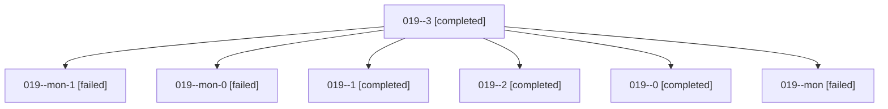

# Family: 019

[Agent Hoods](../README.md) / [bbugyi200](../users/bbugyi200/README.md) / [athena](../users/bbugyi200/machines/athena/README.md) / [019](../users/bbugyi200/machines/athena/hoods/019/README.md) / 019

Owner: `bbugyi200.athena` · Hood: `019` · Members: 7

## Lineage

The diagram is an optional enhancement; the ordered table below contains the same lineage in accessible text.

| Role | Agent | State | Model / provider | Timing | Commits | Prompt | Chat |
|---|---|---|---|---|---:|---|---|
| 3 | 019--3 | completed | gpt-6-astra / codex | 2026-09-07T03:39:24.843747+00:00 → 2026-09-07T05:00:59.546588+00:00 | 0 | [Prompt](../agents/bbugyi200.athena.019--3/prompt.md) | [Chat](../agents/bbugyi200.athena.019--3/chat.md) |
| mon-1 | 019--mon-1 | failed | gpt-6-astra / codex | 2026-09-07T03:36:26.509785+00:00 → 2026-09-07T03:38:58.966248+00:00 | 0 | — | [Chat](../agents/bbugyi200.athena.019--mon-1/chat.md) |
| mon-0 | 019--mon-0 | failed | gpt-6-astra / codex | 2026-09-07T02:56:54.957146+00:00 → 2026-09-07T03:26:40.240456+00:00 | 0 | — | [Chat](../agents/bbugyi200.athena.019--mon-0/chat.md) |
| 1 | 019--1 | completed | gpt-6-astra / codex | 2026-09-07T02:52:28.382088+00:00 → 2026-09-07T02:57:07.702216+00:00 | 0 | [Prompt](../agents/bbugyi200.athena.019--1/prompt.md) | [Chat](../agents/bbugyi200.athena.019--1/chat.md) |
| 2 | 019--2 | completed | gpt-6-astra / codex | 2026-09-07T03:27:33.723045+00:00 → 2026-09-07T03:36:51.599698+00:00 | 0 | [Prompt](../agents/bbugyi200.athena.019--2/prompt.md) | [Chat](../agents/bbugyi200.athena.019--2/chat.md) |
| 0 | 019--0 | completed | gpt-6-astra / codex | 2026-09-07T01:57:41.826100+00:00 → 2026-09-07T02:05:17.388978+00:00 | 0 | [Prompt](../agents/bbugyi200.athena.019--0/prompt.md) | [Chat](../agents/bbugyi200.athena.019--0/chat.md) |
| mon | 019--mon | failed | gpt-6-astra / codex | 2026-09-07T02:05:09.238100+00:00 → 2026-09-07T02:52:02.677712+00:00 | 0 | — | [Chat](../agents/bbugyi200.athena.019--mon/chat.md) |

## Commits

| Role | Repo | Commit | Subject | Committed |
|---|---|---|---|---|
| — | sase | [`ffb676e`](https://github.com/sase-org/sase/commit/ffb676e9c0817f30af18ff1e0c213b4364ecd75a) | chore: Add SDD prompt and plan for remove\_plan\_search\_skill | 2026-06-19 10:44:44 EDT |
| — | sase | [`5c5fe42`](https://github.com/sase-org/sase/commit/5c5fe42a8b4281b5fbabaa986ff1d9d8b38d2f0c) | feat(skills)!: remove unintended sase\_plan\_search skill | 2026-06-19 10:54:54 EDT |
