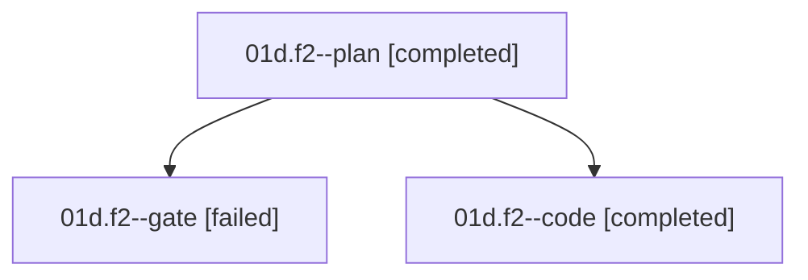

# Family: 01d.f2

[Agent Hoods](../README.md) / [bbugyi200](../users/bbugyi200/README.md) / [athena](../users/bbugyi200/machines/athena/README.md) / [01d](../users/bbugyi200/machines/athena/hoods/01d/README.md) / 01d.f2

Owner: `bbugyi200.athena` · Hood: `01d` · Members: 3

## Lineage

The diagram is an optional enhancement; the ordered table below contains the same lineage in accessible text.

| Role | Agent | State | Model / provider | Timing | Commits | Prompt | Chat |
|---|---|---|---|---|---:|---|---|
| plan | 01d.f2--plan | completed | claude-fable-5 / claude | 2026-09-07T12:59:23.478468+00:00 → 2026-09-07T13:09:56.979430+00:00 | 0 | [Prompt](../agents/bbugyi200.athena.01d.f2--plan/prompt.md) | [Chat](../agents/bbugyi200.athena.01d.f2--plan/chat.md) |
| gate | 01d.f2--gate | failed | claude-fable-5 / claude | 2026-09-07T13:09:49.678644+00:00 → 2026-09-07T13:11:58.111615+00:00 | 0 | — | [Chat](../agents/bbugyi200.athena.01d.f2--gate/chat.md) |
| code | 01d.f2--code | completed | grok-4.6 / grok | 2026-09-07T13:12:04.993407+00:00 → 2026-09-07T13:31:03.673346+00:00 | [1](../agents/bbugyi200.athena.01d.f2--code/README.md#commits) | [Prompt](../agents/bbugyi200.athena.01d.f2--code/prompt.md) | [Chat](../agents/bbugyi200.athena.01d.f2--code/chat.md) |

## Commits

| Role | Repo | Commit | Subject | Committed |
|---|---|---|---|---|
| code | sase | [`e2ce985`](https://github.com/sase-org/sase/commit/e2ce985dd5b0a9014f173d566d334dd8c0514dc3) | fix(bead): give targeted cleanup paths a real owner lookup | 2026-09-07 09:30:13 EDT |

## Neighbors

| Agent | Relation | State |
|---|---|---|
| [01d](../agents/bbugyi200.athena.01d/README.md) | ancestor | completed |
| [01d.f0](../agents/bbugyi200.athena.01d.f0/README.md) | 01d hood | dismissed |
| [01d.f1](../agents/bbugyi200.athena.01d.f1/README.md) | 01d hood | active |
