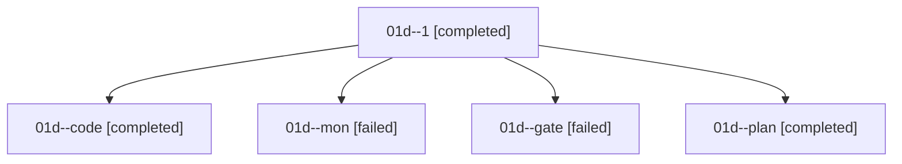

# Family: 01d

[Agent Hoods](../README.md) / [bbugyi200](../users/bbugyi200/README.md) / [athena](../users/bbugyi200/machines/athena/README.md) / [01d](../users/bbugyi200/machines/athena/hoods/01d/README.md) / 01d

Owner: `bbugyi200.athena` · Hood: `01d` · Members: 5

## Lineage

The diagram is an optional enhancement; the ordered table below contains the same lineage in accessible text.

| Role | Agent | State | Model / provider | Timing | Commits | Prompt | Chat |
|---|---|---|---|---|---:|---|---|
| 1 | 01d--1 | completed | grok-4.6 / grok | 2026-09-07T12:32:32.652877+00:00 → 2026-09-07T12:37:47.010879+00:00 | [1](../agents/bbugyi200.athena.01d--1/README.md#commits) | [Prompt](../agents/bbugyi200.athena.01d--1/prompt.md) | [Chat](../agents/bbugyi200.athena.01d--1/chat.md) |
| code | 01d--code | completed | grok-4.6 / grok | 2026-09-07T11:41:43.867286+00:00 → 2026-09-07T12:08:21.011795+00:00 | 0 | [Prompt](../agents/bbugyi200.athena.01d--code/prompt.md) | [Chat](../agents/bbugyi200.athena.01d--code/chat.md) |
| mon | 01d--mon | failed | grok-4.6 / grok | 2026-09-07T12:08:08.387184+00:00 → 2026-09-07T12:32:10.304916+00:00 | 0 | — | [Chat](../agents/bbugyi200.athena.01d--mon/chat.md) |
| gate | 01d--gate | failed | claude-fable-5 / claude | 2026-09-07T11:31:11.037980+00:00 → 2026-09-07T11:41:36.525944+00:00 | 0 | — | [Chat](../agents/bbugyi200.athena.01d--gate/chat.md) |
| plan | 01d--plan | completed | claude-fable-5 / claude | 2026-09-07T11:21:46.655409+00:00 → 2026-09-07T11:31:20.318358+00:00 | 0 | [Prompt](../agents/bbugyi200.athena.01d--plan/prompt.md) | [Chat](../agents/bbugyi200.athena.01d--plan/chat.md) |

## Commits

| Role | Repo | Commit | Subject | Committed |
|---|---|---|---|---|
| — | sase | [`fde8b89`](https://github.com/sase-org/sase/commit/fde8b89c673efb83e7c5c70dc912e16df2b9f5fd) | chore: Add SDD prompt and plan for skip\_waiting\_for\_resolved\_dependencies | 2026-06-19 13:41:45 EDT |
| — | sase | [`7debc17`](https://github.com/sase-org/sase/commit/7debc17587be50a51cd0cb906096fea31583b892) | fix: skip waits for resolved dependencies | 2026-06-19 13:56:30 EDT |
| 1 | sase | [`635c5a3`](https://github.com/sase-org/sase/commit/635c5a31b73c638375f7b93bb42a6d5e21ebccde) | fix(bead): unblock bead work relaunch when assignee is a stale retry descendant | 2026-09-07 08:35:17 EDT |

## Neighbors

| Agent | Relation | State |
|---|---|---|
| [01d.f0](../agents/bbugyi200.athena.01d.f0/README.md) | descendant | dismissed |
| [01d.f1](../agents/bbugyi200.athena.01d.f1/README.md) | descendant | active |
| [01d.f2](bbugyi200.athena.01d.f2.md) (family · 3) | descendant | completed 2, failed 1 |
