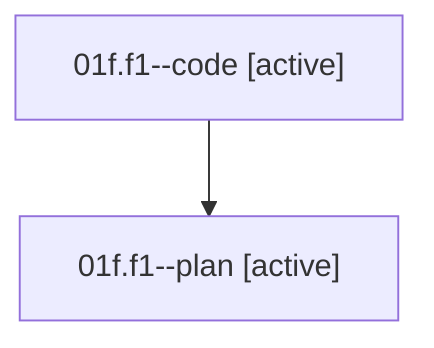

# Family: 01f.f1

[Agent Hoods](../README.md) / [bbugyi200](../users/bbugyi200/README.md) / [athena](../users/bbugyi200/machines/athena/README.md) / [01f](../users/bbugyi200/machines/athena/hoods/01f/README.md) / 01f.f1

Owner: `bbugyi200.athena` · Hood: `01f` · Members: 2

## Lineage

The diagram is an optional enhancement; the ordered table below contains the same lineage in accessible text.

| Role | Agent | State | Model / provider | Timing | Commits | Prompt | Chat |
|---|---|---|---|---|---:|---|---|
| code | 01f.f1--code | active | sonnet / claude | 2026-08-14T17:04:30.386050+00:00 | 0 | — | — |
| plan | 01f.f1--plan | active | gpt-5.6-sol / codex | 2026-08-14T16:58:18.407558+00:00 | 0 | [Prompt](../agents/bbugyi200.athena.01f.f1--plan/prompt.md) | [Chat](../agents/bbugyi200.athena.01f.f1--plan/chat.md) |

## Neighbors

| Agent | Relation | State |
|---|---|---|
| [01f](bbugyi200.athena.01f.md) (family · 2) | ancestor | completed 2 |
| [01f.f2](bbugyi200.athena.01f.f2.md) (family · 5) | 01f hood | active 2, completed 2, failed 1 |
