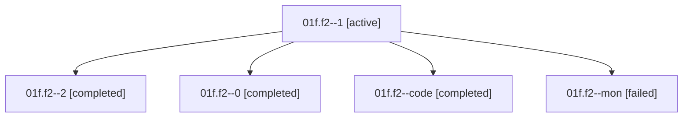

# Family: 01f.f2

[Agent Hoods](../README.md) / [bbugyi200](../users/bbugyi200/README.md) / [athena](../users/bbugyi200/machines/athena/README.md) / [01f](../users/bbugyi200/machines/athena/hoods/01f/README.md) / 01f.f2

Owner: `bbugyi200.athena` · Hood: `01f` · Members: 5

## Lineage

The diagram is an optional enhancement; the ordered table below contains the same lineage in accessible text.

| Role | Agent | State | Model / provider | Timing | Commits | Prompt | Chat |
|---|---|---|---|---|---:|---|---|
| 1 | 01f.f2--1 | active | gpt-5.6-sol / codex | 2026-08-14T17:02:44.843357+00:00 | 0 | — | [Chat](../agents/bbugyi200.athena.01f.f2--1/chat.md) |
| 2 | 01f.f2--2 | completed | sonnet / claude | 2026-08-14T17:10:42.549680+00:00 | 0 | [Prompt](../agents/bbugyi200.athena.01f.f2--2/prompt.md) | [Chat](../agents/bbugyi200.athena.01f.f2--2/chat.md) |
| 0 | 01f.f2--0 | completed | opus / claude | 2026-08-14T16:58:22.892251+00:00 | 0 | [Prompt](../agents/bbugyi200.athena.01f.f2--0/prompt.md) | [Chat](../agents/bbugyi200.athena.01f.f2--0/chat.md) |
| code | 01f.f2--code | completed | sonnet / claude | 2026-08-14T17:06:00.068098+00:00 | 0 | — | [Chat](../agents/bbugyi200.athena.01f.f2--code/chat.md) |
| mon | 01f.f2--mon | failed | sonnet / claude | 2026-08-14T17:08:17.068580+00:00 | 0 | — | [Chat](../agents/bbugyi200.athena.01f.f2--mon/chat.md) |

## Neighbors

| Agent | Relation | State |
|---|---|---|
| [01f](bbugyi200.athena.01f.md) (family · 2) | ancestor | completed 2 |
| [01f.f1](bbugyi200.athena.01f.f1.md) (family · 2) | 01f hood | completed 2 |
