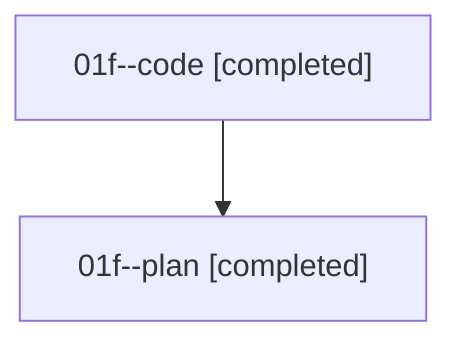

# Family: 01f

[Agent Hoods](../README.md) / [bbugyi200](../users/bbugyi200/README.md) / [athena](../users/bbugyi200/machines/athena/README.md) / [01f](../users/bbugyi200/machines/athena/hoods/01f/README.md) / 01f

Owner: `bbugyi200.athena` · Hood: `01f` · Members: 2

## Lineage

The diagram is an optional enhancement; the ordered table below contains the same lineage in accessible text.

| Role | Agent | State | Model / provider | Timing | Commits | Prompt | Chat |
|---|---|---|---|---|---:|---|---|
| code | 01f--code | completed | sonnet / claude | 2026-08-14T16:46:15.629934+00:00 | [1](../agents/bbugyi200.athena.01f--code/README.md#commits) | — | [Chat](../agents/bbugyi200.athena.01f--code/chat.md) |
| plan | 01f--plan | completed | opus / claude | 2026-08-14T16:36:07.574075+00:00 | 0 | [Prompt](../agents/bbugyi200.athena.01f--plan/prompt.md) | [Chat](../agents/bbugyi200.athena.01f--plan/chat.md) |

## Commits

| Role | Repo | Commit | Subject | Committed |
|---|---|---|---|---|
| code | sase | [`668bfc9`](https://github.com/sase-org/sase/commit/668bfc932e77a1dc57c91928aa6038cd85c14efb) | feat(llm-provider): add grok/grok-4.6 to shipped @smart, @cheap, and @cheaper pools | 2026-08-14 16:57:35 UTC |

## Neighbors

| Agent | Relation | State |
|---|---|---|
| [01f.f1](bbugyi200.athena.01f.f1.md) (family · 2) | descendant | completed 2 |
| [01f.f2](bbugyi200.athena.01f.f2.md) (family · 5) | descendant | active 1, completed 3, failed 1 |
