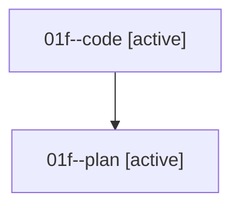

# Family: 01f

[Agent Hoods](../README.md) / [bbugyi200](../users/bbugyi200/README.md) / [athena](../users/bbugyi200/machines/athena/README.md) / [01f](../users/bbugyi200/machines/athena/hoods/01f/README.md) / 01f

Owner: `bbugyi200.athena` · Hood: `01f` · Members: 2

## Lineage

The diagram is an optional enhancement; the ordered table below contains the same lineage in accessible text.

| Role | Agent | State | Model / provider | Timing | Commits | Prompt | Chat |
|---|---|---|---|---|---:|---|---|
| code | 01f--code | active | sonnet / claude | 2026-08-14T16:46:15.629934+00:00 | 0 | — | — |
| plan | 01f--plan | active | opus / claude | 2026-08-14T16:36:07.574075+00:00 | 0 | [Prompt](../agents/bbugyi200.athena.01f--plan/prompt.md) | [Chat](../agents/bbugyi200.athena.01f--plan/chat.md) |

## Neighbors

| Agent | Relation | State |
|---|---|---|
| [01f.f0](../agents/bbugyi200.athena.01f.f0/README.md) | descendant | waiting |
