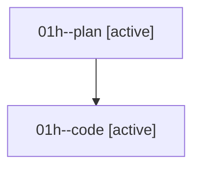

# Family: 01h

[Agent Hoods](../README.md) / [bbugyi200](../users/bbugyi200/README.md) / [athena](../users/bbugyi200/machines/athena/README.md) / [01h](../users/bbugyi200/machines/athena/hoods/01h/README.md) / 01h

Owner: `bbugyi200.athena` · Hood: `01h` · Members: 2

## Lineage

The diagram is an optional enhancement; the ordered table below contains the same lineage in accessible text.

| Role | Agent | State | Model / provider | Timing | Commits | Prompt | Chat |
|---|---|---|---|---|---:|---|---|
| plan | 01h--plan | active | gpt-5.6-sol / codex | 2026-08-14T17:18:07.859590+00:00 | 0 | [Prompt](../agents/bbugyi200.athena.01h--plan/prompt.md) | [Chat](../agents/bbugyi200.athena.01h--plan/chat.md) |
| code | 01h--code | active | sonnet / claude | 2026-08-14T17:21:17.096966+00:00 | 0 | — | — |

## Commits

| Role | Repo | Commit | Subject | Committed |
|---|---|---|---|---|
| — | sase | [`52c5ab2`](https://github.com/sase-org/sase/commit/52c5ab2748bc1e02e5a292b155fdf50f75c854f9) | chore: Add SDD prompt and plan for xprompts\_enabled\_skips\_embedded\_validation | 2026-06-19 14:39:47 EDT |
| — | sase | [`86f89d4`](https://github.com/sase-org/sase/commit/86f89d40fe060d3d809f25b3024e2ab1e36323d1) | fix: ignore embedded prompts in disabled regions | 2026-06-19 14:47:20 EDT |
