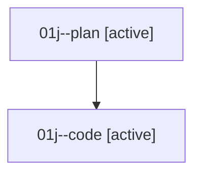

# Family: 01j

[Agent Hoods](../README.md) / [bbugyi200](../users/bbugyi200/README.md) / [athena](../users/bbugyi200/machines/athena/README.md) / [01j](../users/bbugyi200/machines/athena/hoods/01j/README.md) / 01j

Owner: `bbugyi200.athena` · Hood: `01j` · Members: 2

## Lineage

The diagram is an optional enhancement; the ordered table below contains the same lineage in accessible text.

| Role | Agent | State | Model / provider | Timing | Commits | Prompt | Chat |
|---|---|---|---|---|---:|---|---|
| plan | 01j--plan | active | gpt-5.6-sol / codex | 2026-08-14T17:36:34.520281+00:00 | 0 | [Prompt](../agents/bbugyi200.athena.01j--plan/prompt.md) | [Chat](../agents/bbugyi200.athena.01j--plan/chat.md) |
| code | 01j--code | active | gpt-5.5 / codex | 2026-08-14T17:41:57.096436+00:00 | [1](../agents/bbugyi200.athena.01j--code/README.md#commits) | — | — |

## Commits

| Role | Repo | Commit | Subject | Committed |
|---|---|---|---|---|
| code | sase | [`402b3b6`](https://github.com/sase-org/sase/commit/402b3b65ad162ff9ab978342196b4ed3c4807b33) | feat(ace): inherit VCS xprompt tag for added panes | 2026-08-14 13:52:31 EDT |
