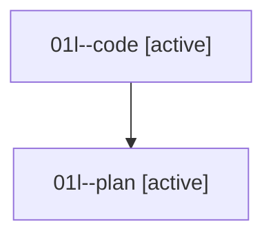

# Family: 01l

[Agent Hoods](../README.md) / [bbugyi200](../users/bbugyi200/README.md) / [athena](../users/bbugyi200/machines/athena/README.md) / [01l](../users/bbugyi200/machines/athena/hoods/01l/README.md) / 01l

Owner: `bbugyi200.athena` · Hood: `01l` · Members: 2

## Lineage

The diagram is an optional enhancement; the ordered table below contains the same lineage in accessible text.

| Role | Agent | State | Model / provider | Timing | Commits | Prompt | Chat |
|---|---|---|---|---|---:|---|---|
| code | 01l--code | active | sonnet / claude | 2026-08-14T17:55:59.412666+00:00 | [1](../agents/bbugyi200.athena.01l--code/README.md#commits) | — | — |
| plan | 01l--plan | active | opus / claude | 2026-08-14T17:40:48.751585+00:00 | 0 | [Prompt](../agents/bbugyi200.athena.01l--plan/prompt.md) | [Chat](../agents/bbugyi200.athena.01l--plan/chat.md) |

## Commits

| Role | Repo | Commit | Subject | Committed |
|---|---|---|---|---|
| — | sase | [`a2c1459`](https://github.com/sase-org/sase/commit/a2c145992fec521a2663f0b47d056032d1ff948c) | chore: Add SDD prompt and plan for finalizer\_opened\_siblings | 2026-06-19 21:09:13 UTC |
| — | sase | [`db79196`](https://github.com/sase-org/sase/commit/db79196c85a1cb339956d58b663fbab3783901c6) | fix: gate finalizer sibling checks by opened workspaces | 2026-06-19 21:20:19 UTC |
| code | sase | [`e701dba`](https://github.com/sase-org/sase/commit/e701dba6853f6632e6179fdc5dd17a558b69bd1e) | fix(ace): stop TUI freeze when a question gate's options contain markup | 2026-08-14 18:51:54 UTC |
