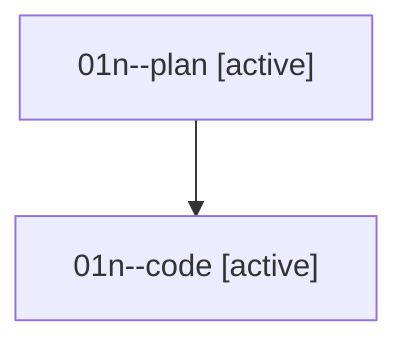

# Family: 01n

[Agent Hoods](../README.md) / [bbugyi200](../users/bbugyi200/README.md) / [athena](../users/bbugyi200/machines/athena/README.md) / [01n](../users/bbugyi200/machines/athena/hoods/01n/README.md) / 01n

Owner: `bbugyi200.athena` · Hood: `01n` · Members: 2

## Lineage

The diagram is an optional enhancement; the ordered table below contains the same lineage in accessible text.

| Role | Agent | State | Model / provider | Timing | Commits | Prompt | Chat |
|---|---|---|---|---|---:|---|---|
| plan | 01n--plan | active | opus / claude | 2026-08-14T17:46:06.696533+00:00 | 0 | [Prompt](../agents/bbugyi200.athena.01n--plan/prompt.md) | [Chat](../agents/bbugyi200.athena.01n--plan/chat.md) |
| code | 01n--code | active | sonnet / claude | 2026-08-14T17:56:16.255707+00:00 | [1](../agents/bbugyi200.athena.01n--code/README.md#commits) | — | — |

## Commits

| Role | Repo | Commit | Subject | Committed |
|---|---|---|---|---|
| — | sase | [`541f5b8`](https://github.com/sase-org/sase/commit/541f5b85c7f80b7d0206bc90c2a3b2bab640c6aa) | chore: Add SDD prompt and plan for completion\_panel\_excess\_height | 2026-06-19 23:06:11 UTC |
| — | sase | [`23a3a5e`](https://github.com/sase-org/sase/commit/23a3a5e87057b5fe24a856baae81dcdbb4ef2e95) | fix(tui): clamp prompt completion height reservation | 2026-06-19 23:15:50 UTC |
| code | sase | [`fa93b3a`](https://github.com/sase-org/sase/commit/fa93b3ad7c31cf1bf57232db25d112643bb7b7bb) | fix(ace): drop xprompt completion spacer when Tab jumps to next tabstop | 2026-08-14 18:11:58 UTC |
