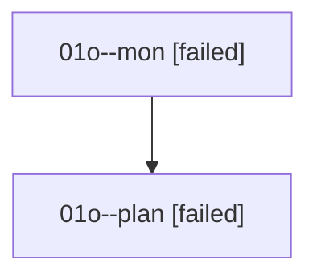

# Family: 01o

[Agent Hoods](../README.md) / [bbugyi200](../users/bbugyi200/README.md) / [athena](../users/bbugyi200/machines/athena/README.md) / [01o](../users/bbugyi200/machines/athena/hoods/01o/README.md) / 01o

Owner: `bbugyi200.athena` · Hood: `01o` · Members: 2

## Lineage

The diagram is an optional enhancement; the ordered table below contains the same lineage in accessible text.

| Role | Agent | State | Model / provider | Timing | Commits | Prompt | Chat |
|---|---|---|---|---|---:|---|---|
| mon | 01o--mon | failed | gpt-5.6-sol / codex | 2026-08-14T18:19:37.036141+00:00 | 0 | — | [Chat](../agents/bbugyi200.athena.01o--mon/chat.md) |
| plan | 01o--plan | failed | gpt-5.6-sol / codex | 2026-08-14T18:06:52.152677+00:00 | 0 | [Prompt](../agents/bbugyi200.athena.01o--plan/prompt.md) | [Chat](../agents/bbugyi200.athena.01o--plan/chat.md) |

## Commits

| Role | Repo | Commit | Subject | Committed |
|---|---|---|---|---|
| — | sase | [`9315d48`](https://github.com/sase-org/sase/commit/9315d48a45538e510b4970a7d933202ca414fb41) | chore: Add SDD prompt and plan for remove\_at\_project\_selector | 2026-06-19 20:55:50 EDT |
