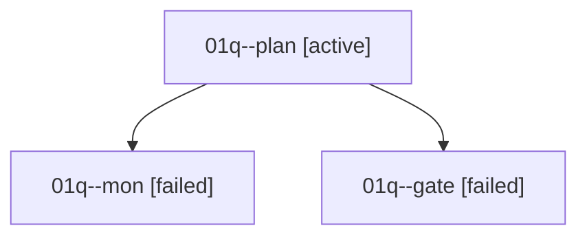

# Family: 01q

[Agent Hoods](../README.md) / [bbugyi200](../users/bbugyi200/README.md) / [athena](../users/bbugyi200/machines/athena/README.md) / [01q](../users/bbugyi200/machines/athena/hoods/01q/README.md) / 01q

Owner: `bbugyi200.athena` · Hood: `01q` · Members: 3

## Lineage

The diagram is an optional enhancement; the ordered table below contains the same lineage in accessible text.

| Role | Agent | State | Model / provider | Timing | Commits | Prompt | Chat |
|---|---|---|---|---|---:|---|---|
| plan | 01q--plan | active | claude-fable-5 / claude | 2026-09-07T13:45:57.882438+00:00 | 0 | [Prompt](../agents/bbugyi200.athena.01q--plan/prompt.md) | [Chat](../agents/bbugyi200.athena.01q--plan/chat.md) |
| mon | 01q--mon | failed | claude-fable-5 / claude | 2026-09-07T14:02:13.426677+00:00 → 2026-09-07T14:04:17.956118+00:00 | 0 | — | [Chat](../agents/bbugyi200.athena.01q--mon/chat.md) |
| gate | 01q--gate | failed | claude-fable-5 / claude | 2026-09-07T14:01:29.138507+00:00 → 2026-09-07T14:02:16.994256+00:00 | 0 | — | [Chat](../agents/bbugyi200.athena.01q--gate/chat.md) |

## Commits

| Role | Repo | Commit | Subject | Committed |
|---|---|---|---|---|
| — | sase | [`7584ee8`](https://github.com/sase-org/sase/commit/7584ee8ce1fdae4451ad9fd1fe84f9fca354fdc3) | chore: Add SDD prompt and plan for xprompt\_completion\_project\_scope | 2026-06-19 21:29:48 EDT |
| — | sase | [`8ed5ba9`](https://github.com/sase-org/sase/commit/8ed5ba9278555d7e43dd4e05e1cecb7d2dc8d09d) | fix(xprompt): keep virtual catalog sources global | 2026-06-19 21:40:54 EDT |
