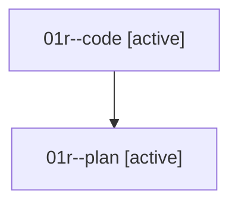

# Family: 01r

[Agent Hoods](../README.md) / [bbugyi200](../users/bbugyi200/README.md) / [athena](../users/bbugyi200/machines/athena/README.md) / [01r](../users/bbugyi200/machines/athena/hoods/01r/README.md) / 01r

Owner: `bbugyi200.athena` · Hood: `01r` · Members: 2

## Lineage

The diagram is an optional enhancement; the ordered table below contains the same lineage in accessible text.

| Role | Agent | State | Model / provider | Timing | Commits | Prompt | Chat |
|---|---|---|---|---|---:|---|---|
| code | 01r--code | active | grok-4.6 / grok | 2026-08-14T19:48:10.070923+00:00 | 0 | — | — |
| plan | 01r--plan | active | opus / claude | 2026-08-14T19:35:15.382703+00:00 | 0 | [Prompt](../agents/bbugyi200.athena.01r--plan/prompt.md) | [Chat](../agents/bbugyi200.athena.01r--plan/chat.md) |
