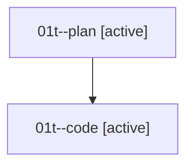

# Family: 01t

[Agent Hoods](../README.md) / [bbugyi200](../users/bbugyi200/README.md) / [athena](../users/bbugyi200/machines/athena/README.md) / [01t](../users/bbugyi200/machines/athena/hoods/01t/README.md) / 01t

Owner: `bbugyi200.athena` · Hood: `01t` · Members: 2

## Lineage

The diagram is an optional enhancement; the ordered table below contains the same lineage in accessible text.

| Role | Agent | State | Model / provider | Timing | Commits | Prompt | Chat |
|---|---|---|---|---|---:|---|---|
| plan | 01t--plan | active | gpt-5.6-sol / codex | 2026-08-14T20:35:22.837001+00:00 | 0 | [Prompt](../agents/bbugyi200.athena.01t--plan/prompt.md) | [Chat](../agents/bbugyi200.athena.01t--plan/chat.md) |
| code | 01t--code | active | sonnet / claude | 2026-08-14T20:43:30.017431+00:00 | [1](../agents/bbugyi200.athena.01t--code/README.md#commits) | — | — |

## Commits

| Role | Repo | Commit | Subject | Committed |
|---|---|---|---|---|
| code | sase | [`d3c5254`](https://github.com/sase-org/sase/commit/d3c5254ca8cbddf7df611592793632ba3b1cb4a7) | feat(cli)!: make \`sase agent show\` take the agent name positionally | 2026-08-14 16:56:46 EDT |
