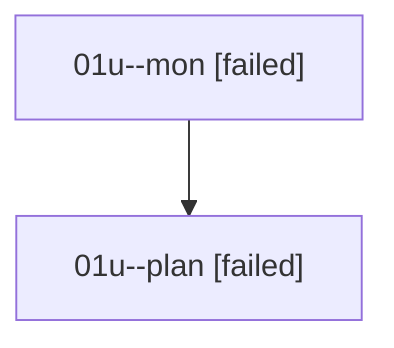

# Family: 01u

[Agent Hoods](../README.md) / [bbugyi200](../users/bbugyi200/README.md) / [athena](../users/bbugyi200/machines/athena/README.md) / [01u](../users/bbugyi200/machines/athena/hoods/01u/README.md) / 01u

Owner: `bbugyi200.athena` · Hood: `01u` · Members: 2

## Lineage

The diagram is an optional enhancement; the ordered table below contains the same lineage in accessible text.

| Role | Agent | State | Model / provider | Timing | Commits | Prompt | Chat |
|---|---|---|---|---|---:|---|---|
| mon | 01u--mon | failed | opus / claude | 2026-08-14T21:05:13.733268+00:00 | 0 | — | [Chat](../agents/bbugyi200.athena.01u--mon/chat.md) |
| plan | 01u--plan | failed | opus / claude | 2026-08-14T20:46:59.390939+00:00 | 0 | [Prompt](../agents/bbugyi200.athena.01u--plan/prompt.md) | [Chat](../agents/bbugyi200.athena.01u--plan/chat.md) |
