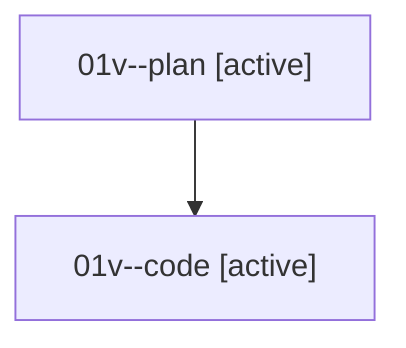

# Family: 01v

[Agent Hoods](../README.md) / [bbugyi200](../users/bbugyi200/README.md) / [athena](../users/bbugyi200/machines/athena/README.md) / [01v](../users/bbugyi200/machines/athena/hoods/01v/README.md) / 01v

Owner: `bbugyi200.athena` · Hood: `01v` · Members: 2

## Lineage

The diagram is an optional enhancement; the ordered table below contains the same lineage in accessible text.

| Role | Agent | State | Model / provider | Timing | Commits | Prompt | Chat |
|---|---|---|---|---|---:|---|---|
| plan | 01v--plan | active | opus / claude | 2026-08-14T21:41:47.829852+00:00 | 0 | [Prompt](../agents/bbugyi200.athena.01v--plan/prompt.md) | [Chat](../agents/bbugyi200.athena.01v--plan/chat.md) |
| code | 01v--code | active | grok-4.6 / grok | 2026-08-14T22:05:16.649532+00:00 | [1](../agents/bbugyi200.athena.01v--code/README.md#commits) | — | — |

## Commits

| Role | Repo | Commit | Subject | Committed |
|---|---|---|---|---|
| code | sase | [`f59e307`](https://github.com/sase-org/sase/commit/f59e30717cc06c962d5acf4406a43b65372f9184) | fix(ace): demote owning-xprompt preview inside shorthand argument text | 2026-08-14 18:34:19 EDT |

## Neighbors

| Agent | Relation | State |
|---|---|---|
| [01v.f1](../agents/bbugyi200.athena.01v.f1/README.md) | descendant | completed |
