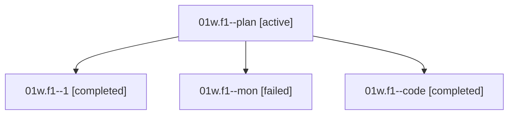

# Family: 01w.f1

[Agent Hoods](../README.md) / [bbugyi200](../users/bbugyi200/README.md) / [athena](../users/bbugyi200/machines/athena/README.md) / [01w](../users/bbugyi200/machines/athena/hoods/01w/README.md) / 01w.f1

Owner: `bbugyi200.athena` · Hood: `01w` · Members: 4

## Lineage

The diagram is an optional enhancement; the ordered table below contains the same lineage in accessible text.

| Role | Agent | State | Model / provider | Timing | Commits | Prompt | Chat |
|---|---|---|---|---|---:|---|---|
| plan | 01w.f1--plan | active | gpt-5.6-sol / codex | 2026-08-14T23:38:48.715096+00:00 | 0 | [Prompt](../agents/bbugyi200.athena.01w.f1--plan/prompt.md) | [Chat](../agents/bbugyi200.athena.01w.f1--plan/chat.md) |
| 1 | 01w.f1--1 | completed | gpt-5.5 / codex | 2026-08-15T00:34:58.167992+00:00 | 0 | [Prompt](../agents/bbugyi200.athena.01w.f1--1/prompt.md) | [Chat](../agents/bbugyi200.athena.01w.f1--1/chat.md) |
| mon | 01w.f1--mon | failed | gpt-5.5 / codex | 2026-08-15T00:22:26.926342+00:00 | 0 | — | [Chat](../agents/bbugyi200.athena.01w.f1--mon/chat.md) |
| code | 01w.f1--code | completed | gpt-5.5 / codex | 2026-08-15T00:14:06.824067+00:00 | [1](../agents/bbugyi200.athena.01w.f1--code/README.md#commits) | — | [Chat](../agents/bbugyi200.athena.01w.f1--code/chat.md) |

## Commits

| Role | Repo | Commit | Subject | Committed |
|---|---|---|---|---|
| code | sase | [`97e12b2`](https://github.com/sase-org/sase/commit/97e12b29e4c0a72425396f5a2baca8c751801e80) | feat(llm): add antigravity flash to cheaper pool | 2026-08-14 20:23:10 EDT |

## Neighbors

| Agent | Relation | State |
|---|---|---|
| [01w](bbugyi200.athena.01w.md) (family · 4) | ancestor | active 1, completed 2, failed 1 |
