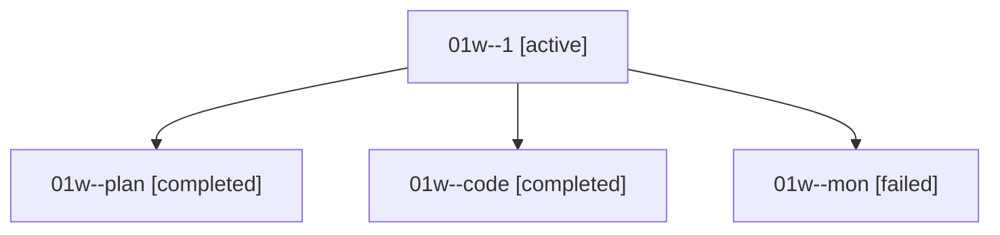

# Family: 01w

[Agent Hoods](../README.md) / [bbugyi200](../users/bbugyi200/README.md) / [athena](../users/bbugyi200/machines/athena/README.md) / [01w](../users/bbugyi200/machines/athena/hoods/01w/README.md) / 01w

Owner: `bbugyi200.athena` · Hood: `01w` · Members: 4

## Lineage

The diagram is an optional enhancement; the ordered table below contains the same lineage in accessible text.

| Role | Agent | State | Model / provider | Timing | Commits | Prompt | Chat |
|---|---|---|---|---|---:|---|---|
| 1 | 01w--1 | active | sonnet / claude | 2026-08-14T23:34:05.121384+00:00 | [1](../agents/bbugyi200.athena.01w--1/README.md#commits) | [Prompt](../agents/bbugyi200.athena.01w--1/prompt.md) | — |
| plan | 01w--plan | completed | gpt-5.6-sol / codex | 2026-08-14T22:49:50.541236+00:00 | 0 | [Prompt](../agents/bbugyi200.athena.01w--plan/prompt.md) | [Chat](../agents/bbugyi200.athena.01w--plan/chat.md) |
| code | 01w--code | completed | sonnet / claude | 2026-08-14T22:57:27.054983+00:00 | 0 | — | [Chat](../agents/bbugyi200.athena.01w--code/chat.md) |
| mon | 01w--mon | failed | sonnet / claude | 2026-08-14T23:21:45.074237+00:00 | 0 | — | [Chat](../agents/bbugyi200.athena.01w--mon/chat.md) |

## Commits

| Role | Repo | Commit | Subject | Committed |
|---|---|---|---|---|
| 1 | sase | [`9c66daf`](https://github.com/sase-org/sase/commit/9c66dafee99f15623a3969f3c394a6ecb6161ce0) | feat(agy): add Gemini 3.7 Flash and make it Antigravity's default | 2026-08-14 19:34:56 EDT |

## Neighbors

| Agent | Relation | State |
|---|---|---|
| [01w.f0](../agents/bbugyi200.athena.01w.f0/README.md) | descendant | waiting |
