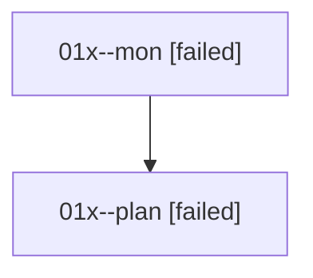

# Family: 01x

[Agent Hoods](../README.md) / [bbugyi200](../users/bbugyi200/README.md) / [athena](../users/bbugyi200/machines/athena/README.md) / [01x](../users/bbugyi200/machines/athena/hoods/01x/README.md) / 01x

Owner: `bbugyi200.athena` · Hood: `01x` · Members: 2

## Lineage

The diagram is an optional enhancement; the ordered table below contains the same lineage in accessible text.

| Role | Agent | State | Model / provider | Timing | Commits | Prompt | Chat |
|---|---|---|---|---|---:|---|---|
| mon | 01x--mon | failed | gpt-5.6-sol / codex | 2026-08-14T23:16:38.550263+00:00 | 0 | — | [Chat](../agents/bbugyi200.athena.01x--mon/chat.md) |
| plan | 01x--plan | failed | gpt-5.6-sol / codex | 2026-08-14T23:11:14.983452+00:00 | 0 | [Prompt](../agents/bbugyi200.athena.01x--plan/prompt.md) | [Chat](../agents/bbugyi200.athena.01x--plan/chat.md) |
