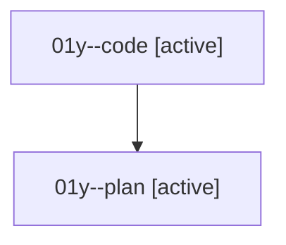

# Family: 01y

[Agent Hoods](../README.md) / [bbugyi200](../users/bbugyi200/README.md) / [athena](../users/bbugyi200/machines/athena/README.md) / [01y](../users/bbugyi200/machines/athena/hoods/01y/README.md) / 01y

Owner: `bbugyi200.athena` · Hood: `01y` · Members: 2

## Lineage

The diagram is an optional enhancement; the ordered table below contains the same lineage in accessible text.

| Role | Agent | State | Model / provider | Timing | Commits | Prompt | Chat |
|---|---|---|---|---|---:|---|---|
| code | 01y--code | active | grok-4.6 / grok | 2026-08-15T09:31:21.217303+00:00 | [1](../agents/bbugyi200.athena.01y--code/README.md#commits) | — | — |
| plan | 01y--plan | active | gpt-5.6-sol / codex | 2026-08-15T09:24:43.383930+00:00 | 0 | [Prompt](../agents/bbugyi200.athena.01y--plan/prompt.md) | [Chat](../agents/bbugyi200.athena.01y--plan/chat.md) |

## Commits

| Role | Repo | Commit | Subject | Committed |
|---|---|---|---|---|
| — | sase | [`19ca730`](https://github.com/sase-org/sase/commit/19ca7309703f2475a516f853d848207ad45f088e) | chore: Add SDD prompt and plan for agent\_tag\_enter\_clears | 2026-06-20 02:20:27 UTC |
| — | sase | [`c280737`](https://github.com/sase-org/sase/commit/c2807378840d353a7c158a616d6ce8a2d5145354) | fix: clear tag modal input for tagged agents | 2026-06-20 02:26:52 UTC |
| code | sase | [`6f027ae`](https://github.com/sase-org/sase/commit/6f027ae6b499eeec91608ccaa9f848a93dd23248) | fix(beads): pin child-epic monitors to clanned phase lanes | 2026-08-15 09:39:08 UTC |
