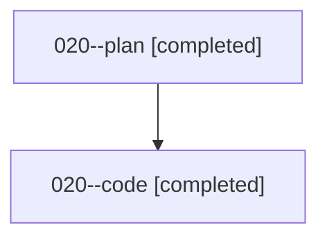

# Family: 020

[Agent Hoods](../README.md) / [bbugyi200](../users/bbugyi200/README.md) / [athena](../users/bbugyi200/machines/athena/README.md) / [020](../users/bbugyi200/machines/athena/hoods/020/README.md) / 020

Owner: `bbugyi200.athena` · Hood: `020` · Members: 2

## Lineage

The diagram is an optional enhancement; the ordered table below contains the same lineage in accessible text.

| Role | Agent | State | Model / provider | Timing | Commits | Prompt | Chat |
|---|---|---|---|---|---:|---|---|
| plan | 020--plan | completed | gpt-5.6-sol / codex | 2026-08-15T11:15:04.791345+00:00 | 0 | [Prompt](../agents/bbugyi200.athena.020--plan/prompt.md) | [Chat](../agents/bbugyi200.athena.020--plan/chat.md) |
| code | 020--code | completed | sonnet / claude | 2026-08-15T11:17:39.576888+00:00 | [1](../agents/bbugyi200.athena.020--code/README.md#commits) | — | [Chat](../agents/bbugyi200.athena.020--code/chat.md) |

## Commits

| Role | Repo | Commit | Subject | Committed |
|---|---|---|---|---|
| — | sase | [`0391b12`](https://github.com/sase-org/sase/commit/0391b12435b8c4644ced791d5f990e6a8812a30b) | chore: Add SDD prompt and plan for completion\_directives\_skills | 2026-06-20 00:01:45 EDT |
| — | sase | [`27258f1`](https://github.com/sase-org/sase/commit/27258f105b87e5f70fc59ab5bc712ab857e23eac) | feat(ace): auto-open completion menu for directives and xprompt skills | 2026-06-20 00:18:34 EDT |
| code | sase | [`7183571`](https://github.com/sase-org/sase/commit/71835710281e47198437589bc30588bb61f803a4) | feat(llm-provider): select Gemini 3.7 Flash High for Antigravity in @cheaper | 2026-08-15 07:21:57 EDT |
