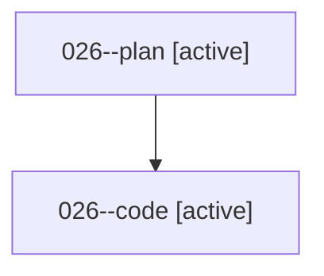

# Family: 026

[Agent Hoods](../README.md) / [bbugyi200](../users/bbugyi200/README.md) / [athena](../users/bbugyi200/machines/athena/README.md) / [026](../users/bbugyi200/machines/athena/hoods/026/README.md) / 026

Owner: `bbugyi200.athena` · Hood: `026` · Members: 2

## Lineage

The diagram is an optional enhancement; the ordered table below contains the same lineage in accessible text.

| Role | Agent | State | Model / provider | Timing | Commits | Prompt | Chat |
|---|---|---|---|---|---:|---|---|
| plan | 026--plan | active | gpt-5.6-sol / codex | 2026-08-15T13:29:51.818072+00:00 | 0 | [Prompt](../agents/bbugyi200.athena.026--plan/prompt.md) | [Chat](../agents/bbugyi200.athena.026--plan/chat.md) |
| code | 026--code | active | grok-4.6 / grok | 2026-08-15T13:35:18.474300+00:00 | 0 | — | — |
