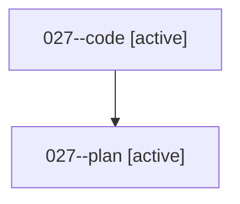

# Family: 027

[Agent Hoods](../README.md) / [bbugyi200](../users/bbugyi200/README.md) / [athena](../users/bbugyi200/machines/athena/README.md) / [027](../users/bbugyi200/machines/athena/hoods/027/README.md) / 027

Owner: `bbugyi200.athena` · Hood: `027` · Members: 2

## Lineage

The diagram is an optional enhancement; the ordered table below contains the same lineage in accessible text.

| Role | Agent | State | Model / provider | Timing | Commits | Prompt | Chat |
|---|---|---|---|---|---:|---|---|
| code | 027--code | active | gpt-5.5 / codex | 2026-08-15T13:37:37.264364+00:00 | [1](../agents/bbugyi200.athena.027--code/README.md#commits) | — | — |
| plan | 027--plan | active | gpt-5.6-sol / codex | 2026-08-15T13:34:37.879327+00:00 | 0 | [Prompt](../agents/bbugyi200.athena.027--plan/prompt.md) | [Chat](../agents/bbugyi200.athena.027--plan/chat.md) |

## Commits

| Role | Repo | Commit | Subject | Committed |
|---|---|---|---|---|
| code | sase | [`4197762`](https://github.com/sase-org/sase/commit/41977629d7b5d15c8c5b2273dd46f4cbb04bad0a) | docs: restore agent lane glossary entry | 2026-08-15 14:04:57 UTC |
