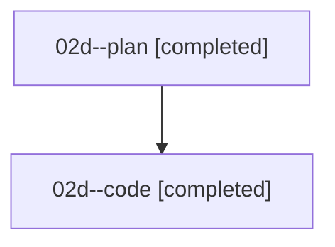

# Family: 02d

[Agent Hoods](../README.md) / [bbugyi200](../users/bbugyi200/README.md) / [athena](../users/bbugyi200/machines/athena/README.md) / [02d](../users/bbugyi200/machines/athena/hoods/02d/README.md) / 02d

Owner: `bbugyi200.athena` · Hood: `02d` · Members: 2

## Lineage

The diagram is an optional enhancement; the ordered table below contains the same lineage in accessible text.

| Role | Agent | State | Model / provider | Timing | Commits | Prompt | Chat |
|---|---|---|---|---|---:|---|---|
| plan | 02d--plan | completed | gpt-5.6-sol / codex | 2026-08-15T14:47:09.486517+00:00 | 0 | [Prompt](../agents/bbugyi200.athena.02d--plan/prompt.md) | [Chat](../agents/bbugyi200.athena.02d--plan/chat.md) |
| code | 02d--code | completed | gpt-5.5 / codex | 2026-08-15T15:01:29.069671+00:00 | [1](../agents/bbugyi200.athena.02d--code/README.md#commits) | — | [Chat](../agents/bbugyi200.athena.02d--code/chat.md) |

## Commits

| Role | Repo | Commit | Subject | Committed |
|---|---|---|---|---|
| — | sase | [`a460fd6`](https://github.com/sase-org/sase/commit/a460fd6ed3e1d36ea6c2e8c1ad6f278a5cc70c5a) | chore: Add SDD prompt and plan for alt\_brace\_syntax | 2026-06-20 18:25:40 UTC |
| — | sase | [`ebf931b`](https://github.com/sase-org/sase/commit/ebf931b3024c0bf179256f465166124bfb0c96d6) | chore: Create epic + phase beads for alt\_brace\_syntax | 2026-06-20 18:53:12 UTC |
| code | sase | [`435cb34`](https://github.com/sase-org/sase/commit/435cb34df1e5c0fb82475d8f1efa8e1e92385845) | fix: complete hyphenated prompt words | 2026-08-15 15:11:32 UTC |
