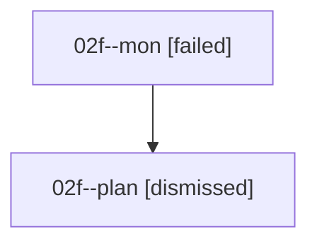

# Family: 02f

[Agent Hoods](../README.md) / [bbugyi200](../users/bbugyi200/README.md) / [athena](../users/bbugyi200/machines/athena/README.md) / [02f](../users/bbugyi200/machines/athena/hoods/02f/README.md) / 02f

Owner: `bbugyi200.athena` · Hood: `02f` · Members: 2

## Lineage

The diagram is an optional enhancement; the ordered table below contains the same lineage in accessible text.

| Role | Agent | State | Model / provider | Timing | Commits | Prompt | Chat |
|---|---|---|---|---|---:|---|---|
| mon | 02f--mon | failed | gpt-5.6-sol / codex | 2026-08-15T15:09:52.531048+00:00 | 0 | — | [Chat](../agents/bbugyi200.athena.02f--mon/chat.md) |
| plan | 02f--plan | dismissed | gpt-5.6-sol / codex | 2026-08-15T10:55:34.115471 → 2026-08-15T11:09:47.294425 | 0 | — | — |
