# Family: 02i

[Agent Hoods](../README.md) / [bbugyi200](../users/bbugyi200/README.md) / [athena](../users/bbugyi200/machines/athena/README.md) / [02i](../users/bbugyi200/machines/athena/hoods/02i/README.md) / 02i

Owner: `bbugyi200.athena` · Hood: `02i` · Members: 18

## Lineage

```mermaid
flowchart TD
  n0["02i--mon-5 [failed]"]
  n1["02i--mon-6 [failed]"]
  n0 --> n1
  n2["02i--mon-3 [failed]"]
  n0 --> n2
  n3["02i--mon-1 [failed]"]
  n0 --> n3
  n4["02i--3 [completed]"]
  n0 --> n4
  n5["02i--0 [dismissed]"]
  n0 --> n5
  n6["02i--5 [active]"]
  n0 --> n6
  n7["02i--4 [active]"]
  n0 --> n7
  n8["02i--2 [active]"]
  n0 --> n8
  n9["02i--1 [active]"]
  n0 --> n9
  n10["02i--7 [failed]"]
  n0 --> n10
  n11["02i--mon-4 [failed]"]
  n0 --> n11
  n12["02i--6 [completed]"]
  n0 --> n12
  n13["02i--mon-7 [failed]"]
  n0 --> n13
  n14["02i--mon-2 [failed]"]
  n0 --> n14
  n15["02i--code [completed]"]
  n0 --> n15
  n16["02i--mon-0 [failed]"]
  n0 --> n16
  n17["02i--mon [failed]"]
  n0 --> n17
```

The diagram is an optional enhancement; the ordered table below contains the same lineage in accessible text.

| Role | Agent | State | Model / provider | Timing | Commits | Prompt | Chat |
|---|---|---|---|---|---:|---|---|
| mon-5 | 02i--mon-5 | failed | gpt-5.6-sol / codex | 2026-08-15T18:20:44.571049+00:00 | 0 | — | [Chat](../agents/bbugyi200.athena.02i--mon-5/chat.md) |
| mon-6 | 02i--mon-6 | failed | gpt-5.6-sol / codex | 2026-08-15T18:27:28.199276+00:00 | 0 | — | [Chat](../agents/bbugyi200.athena.02i--mon-6/chat.md) |
| mon-3 | 02i--mon-3 | failed | gpt-5.6-sol / codex | 2026-08-15T18:06:57.428942+00:00 | 0 | — | [Chat](../agents/bbugyi200.athena.02i--mon-3/chat.md) |
| mon-1 | 02i--mon-1 | failed | gpt-5.6-sol / codex | 2026-08-15T17:58:29.570280+00:00 | 0 | — | [Chat](../agents/bbugyi200.athena.02i--mon-1/chat.md) |
| 3 | 02i--3 | completed | gpt-5.6-sol / codex | 2026-08-15T18:06:13.237295+00:00 | 0 | [Prompt](../agents/bbugyi200.athena.02i--3/prompt.md) | [Chat](../agents/bbugyi200.athena.02i--3/chat.md) |
| 0 | 02i--0 | dismissed | gpt-5.6-sol / codex | 2026-08-15T12:16:50.981074 → 2026-08-15T14:57:49.734289 | 0 | — | [Chat](../agents/bbugyi200.athena.02i--0/chat.md) |
| 5 | 02i--5 | active | gpt-5.6-sol / codex | 2026-08-15T18:18:51.084031+00:00 | 0 | [Prompt](../agents/bbugyi200.athena.02i--5/prompt.md) | — |
| 4 | 02i--4 | active | gpt-5.6-sol / codex | 2026-08-15T18:09:16.939877+00:00 | 0 | [Prompt](../agents/bbugyi200.athena.02i--4/prompt.md) | — |
| 2 | 02i--2 | active | gpt-5.6-sol / codex | 2026-08-15T18:01:48.218973+00:00 | 0 | [Prompt](../agents/bbugyi200.athena.02i--2/prompt.md) | — |
| 1 | 02i--1 | active | gpt-5.6-sol / codex | 2026-08-15T16:24:55.978843+00:00 | [3](../agents/bbugyi200.athena.02i--1/README.md#commits) | [Prompt](../agents/bbugyi200.athena.02i--1/prompt.md) | — |
| 7 | 02i--7 | failed | gpt-5.6-sol / codex | 20260815145837 | 0 | [Prompt](../agents/bbugyi200.athena.02i--7/prompt.md) | — |
| mon-4 | 02i--mon-4 | failed | gpt-5.6-sol / codex | 2026-08-15T18:12:36.385867+00:00 | 0 | — | [Chat](../agents/bbugyi200.athena.02i--mon-4/chat.md) |
| 6 | 02i--6 | completed | gpt-5.6-sol / codex | 2026-08-15T18:23:59.670332+00:00 | 0 | [Prompt](../agents/bbugyi200.athena.02i--6/prompt.md) | [Chat](../agents/bbugyi200.athena.02i--6/chat.md) |
| mon-7 | 02i--mon-7 | failed | gpt-5.6-sol / codex | 2026-08-15T18:54:38.821441+00:00 | 0 | — | [Chat](../agents/bbugyi200.athena.02i--mon-7/chat.md) |
| mon-2 | 02i--mon-2 | failed | gpt-5.6-sol / codex | 2026-08-15T18:02:59.169016+00:00 | 0 | — | [Chat](../agents/bbugyi200.athena.02i--mon-2/chat.md) |
| code | 02i--code | completed | gpt-5.5 / codex | 2026-08-15T17:04:55.218264+00:00 | [1](../agents/bbugyi200.athena.02i--code/README.md#commits) | — | [Chat](../agents/bbugyi200.athena.02i--code/chat.md) |
| mon-0 | 02i--mon-0 | failed | gpt-5.5 / codex | 2026-08-15T17:57:54.768476+00:00 | 0 | — | — |
| mon | 02i--mon | failed | gpt-5.6-sol / codex | 2026-08-15T16:21:44.689762+00:00 | 0 | — | [Chat](../agents/bbugyi200.athena.02i--mon/chat.md) |

## Commits

| Role | Repo | Commit | Subject | Committed |
|---|---|---|---|---|
| 1 | sase | [`d580a55`](https://github.com/sase-org/sase/commit/d580a55c8729e893c987aa18b3c7d68a5481ce88) | feat(tui): finish flat pane query migration | 2026-08-15 18:04:56 UTC |
| 1 | sase | [`8965656`](https://github.com/sase-org/sase/commit/8965656eacb8475457a75106030241a005ea774b) | perf(tui): debounce Stitches detail rendering | 2026-08-15 18:06:48 UTC |
| 1 | sase | [`9005843`](https://github.com/sase-org/sase/commit/90058437ebdeb703d016ef5e6c8cb4ca24461aa9) | test(perf): isolate navigation benchmark bursts | 2026-08-15 18:12:57 UTC |
| code | sase | [`c62765e`](https://github.com/sase-org/sase/commit/c62765eb7f3bca0e3a171ab923a5c25e4d6554e4) | feat(ace): complete flat artifact query migration | 2026-08-15 18:55:45 UTC |
