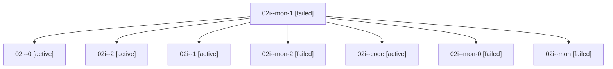

# Family: 02i

[Agent Hoods](../README.md) / [bbugyi200](../users/bbugyi200/README.md) / [athena](../users/bbugyi200/machines/athena/README.md) / [02i](../users/bbugyi200/machines/athena/hoods/02i/README.md) / 02i

Owner: `bbugyi200.athena` · Hood: `02i` · Members: 8

## Lineage

The diagram is an optional enhancement; the ordered table below contains the same lineage in accessible text.

| Role | Agent | State | Model / provider | Timing | Commits | Prompt | Chat |
|---|---|---|---|---|---:|---|---|
| mon-1 | 02i--mon-1 | failed | gpt-5.6-sol / codex | 2026-08-15T17:58:29.570280+00:00 | 0 | — | [Chat](../agents/bbugyi200.athena.02i--mon-1/chat.md) |
| 0 | 02i--0 | active | gpt-5.6-sol / codex | 2026-08-15T16:16:50.981074+00:00 | 0 | [Prompt](../agents/bbugyi200.athena.02i--0/prompt.md) | [Chat](../agents/bbugyi200.athena.02i--0/chat.md) |
| 2 | 02i--2 | active | gpt-5.6-sol / codex | 2026-08-15T18:01:48.218973+00:00 | 0 | [Prompt](../agents/bbugyi200.athena.02i--2/prompt.md) | — |
| 1 | 02i--1 | active | gpt-5.6-sol / codex | 2026-08-15T16:24:55.978843+00:00 | [1](../agents/bbugyi200.athena.02i--1/README.md#commits) | [Prompt](../agents/bbugyi200.athena.02i--1/prompt.md) | — |
| mon-2 | 02i--mon-2 | failed | gpt-5.6-sol / codex | 2026-08-15T18:02:59.169016+00:00 | 0 | — | [Chat](../agents/bbugyi200.athena.02i--mon-2/chat.md) |
| code | 02i--code | active | gpt-5.5 / codex | 2026-08-15T17:04:55.218264+00:00 | 0 | — | — |
| mon-0 | 02i--mon-0 | failed | gpt-5.5 / codex | 2026-08-15T17:57:54.768476+00:00 | 0 | — | — |
| mon | 02i--mon | failed | gpt-5.6-sol / codex | 2026-08-15T16:21:44.689762+00:00 | 0 | — | [Chat](../agents/bbugyi200.athena.02i--mon/chat.md) |

## Commits

| Role | Repo | Commit | Subject | Committed |
|---|---|---|---|---|
| 1 | sase | [`d580a55`](https://github.com/sase-org/sase/commit/d580a55c8729e893c987aa18b3c7d68a5481ce88) | feat(tui): finish flat pane query migration | 2026-08-15 14:04:56 EDT |
