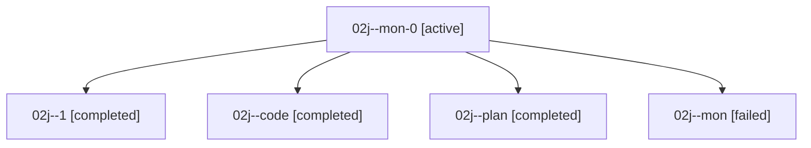

# Family: 02j

[Agent Hoods](../README.md) / [bbugyi200](../users/bbugyi200/README.md) / [athena](../users/bbugyi200/machines/athena/README.md) / [02j](../users/bbugyi200/machines/athena/hoods/02j/README.md) / 02j

Owner: `bbugyi200.athena` · Hood: `02j` · Members: 5

## Lineage

The diagram is an optional enhancement; the ordered table below contains the same lineage in accessible text.

| Role | Agent | State | Model / provider | Timing | Commits | Prompt | Chat |
|---|---|---|---|---|---:|---|---|
| mon-0 | 02j--mon-0 | active | gpt-5.5 / codex | 2026-08-15T18:00:27.254629+00:00 | 0 | — | — |
| 1 | 02j--1 | completed | gpt-5.5 / codex | 2026-08-15T17:54:47.743755+00:00 | [1](../agents/bbugyi200.athena.02j--1/README.md#commits) | [Prompt](../agents/bbugyi200.athena.02j--1/prompt.md) | [Chat](../agents/bbugyi200.athena.02j--1/chat.md) |
| code | 02j--code | completed | gpt-5.5 / codex | 2026-08-15T17:23:57.846936+00:00 | 0 | — | [Chat](../agents/bbugyi200.athena.02j--code/chat.md) |
| plan | 02j--plan | completed | gpt-5.6-sol / codex | 2026-08-15T17:12:31.068156+00:00 | 0 | [Prompt](../agents/bbugyi200.athena.02j--plan/prompt.md) | [Chat](../agents/bbugyi200.athena.02j--plan/chat.md) |
| mon | 02j--mon | failed | gpt-5.5 / codex | 2026-08-15T17:40:15.912208+00:00 | 0 | — | [Chat](../agents/bbugyi200.athena.02j--mon/chat.md) |

## Commits

| Role | Repo | Commit | Subject | Committed |
|---|---|---|---|---|
| 1 | sase | [`87a5698`](https://github.com/sase-org/sase/commit/87a569884f80ece1aca82ee011235eeb22ae69ec) | fix: resume nested epic landing handoffs | 2026-08-15 18:12:23 UTC |
