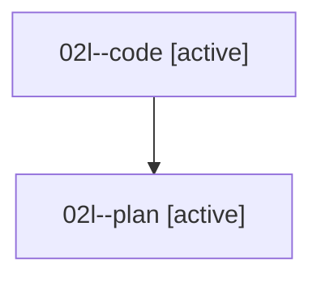

# Family: 02l

[Agent Hoods](../README.md) / [bbugyi200](../users/bbugyi200/README.md) / [athena](../users/bbugyi200/machines/athena/README.md) / [02l](../users/bbugyi200/machines/athena/hoods/02l/README.md) / 02l

Owner: `bbugyi200.athena` · Hood: `02l` · Members: 2

## Lineage

The diagram is an optional enhancement; the ordered table below contains the same lineage in accessible text.

| Role | Agent | State | Model / provider | Timing | Commits | Prompt | Chat |
|---|---|---|---|---|---:|---|---|
| code | 02l--code | active | grok-4.6 / grok | 2026-08-15T17:52:04.440312+00:00 | 0 | — | — |
| plan | 02l--plan | active | gpt-5.6-sol / codex | 2026-08-15T17:45:42.953685+00:00 | 0 | [Prompt](../agents/bbugyi200.athena.02l--plan/prompt.md) | [Chat](../agents/bbugyi200.athena.02l--plan/chat.md) |
