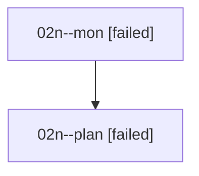

# Family: 02n

[Agent Hoods](../README.md) / [bbugyi200](../users/bbugyi200/README.md) / [athena](../users/bbugyi200/machines/athena/README.md) / [02n](../users/bbugyi200/machines/athena/hoods/02n/README.md) / 02n

Owner: `bbugyi200.athena` · Hood: `02n` · Members: 2

## Lineage

The diagram is an optional enhancement; the ordered table below contains the same lineage in accessible text.

| Role | Agent | State | Model / provider | Timing | Commits | Prompt | Chat |
|---|---|---|---|---|---:|---|---|
| mon | 02n--mon | failed | gpt-5.6-sol / codex | 2026-08-15T18:28:36.364804+00:00 | 0 | — | [Chat](../agents/bbugyi200.athena.02n--mon/chat.md) |
| plan | 02n--plan | failed | gpt-5.6-sol / codex | 2026-08-15T18:10:15.545290+00:00 | 0 | [Prompt](../agents/bbugyi200.athena.02n--plan/prompt.md) | [Chat](../agents/bbugyi200.athena.02n--plan/chat.md) |

## Neighbors

| Agent | Relation | State |
|---|---|---|
| [02n.f1](../agents/bbugyi200.athena.02n.f1/README.md) | descendant | completed |
