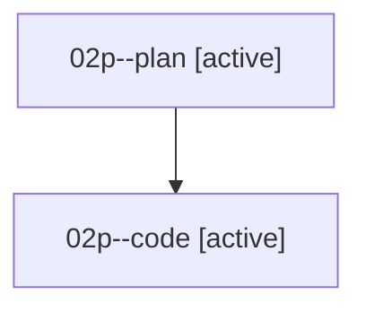

# Family: 02p

[Agent Hoods](../README.md) / [bbugyi200](../users/bbugyi200/README.md) / [athena](../users/bbugyi200/machines/athena/README.md) / [02p](../users/bbugyi200/machines/athena/hoods/02p/README.md) / 02p

Owner: `bbugyi200.athena` · Hood: `02p` · Members: 2

## Lineage

The diagram is an optional enhancement; the ordered table below contains the same lineage in accessible text.

| Role | Agent | State | Model / provider | Timing | Commits | Prompt | Chat |
|---|---|---|---|---|---:|---|---|
| plan | 02p--plan | active | gpt-5.6-sol / codex | 2026-08-15T18:14:08.942019+00:00 | 0 | [Prompt](../agents/bbugyi200.athena.02p--plan/prompt.md) | [Chat](../agents/bbugyi200.athena.02p--plan/chat.md) |
| code | 02p--code | active | gpt-5.5 / codex | 2026-08-15T18:28:27.148318+00:00 | 0 | — | — |

## Neighbors

| Agent | Relation | State |
|---|---|---|
| [02p.f0](../agents/bbugyi200.athena.02p.f0/README.md) | descendant | waiting |
