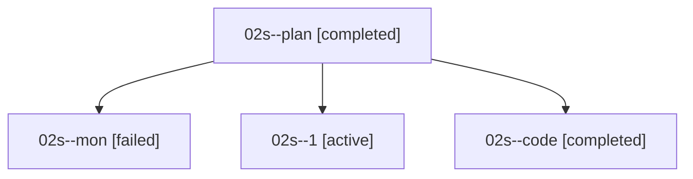

# Family: 02s

[Agent Hoods](../README.md) / [bbugyi200](../users/bbugyi200/README.md) / [athena](../users/bbugyi200/machines/athena/README.md) / [02s](../users/bbugyi200/machines/athena/hoods/02s/README.md) / 02s

Owner: `bbugyi200.athena` · Hood: `02s` · Members: 4

## Lineage

The diagram is an optional enhancement; the ordered table below contains the same lineage in accessible text.

| Role | Agent | State | Model / provider | Timing | Commits | Prompt | Chat |
|---|---|---|---|---|---:|---|---|
| plan | 02s--plan | completed | gpt-5.6-sol / codex | 2026-08-15T19:16:14.935505+00:00 | 0 | [Prompt](../agents/bbugyi200.athena.02s--plan/prompt.md) | [Chat](../agents/bbugyi200.athena.02s--plan/chat.md) |
| mon | 02s--mon | failed | gpt-5.5 / codex | 2026-08-15T19:46:34.640313+00:00 | 0 | — | [Chat](../agents/bbugyi200.athena.02s--mon/chat.md) |
| 1 | 02s--1 | active | gpt-5.5 / codex | 2026-08-15T20:02:25.084014+00:00 | 0 | [Prompt](../agents/bbugyi200.athena.02s--1/prompt.md) | — |
| code | 02s--code | completed | gpt-5.5 / codex | 2026-08-15T19:27:18.489480+00:00 | [1](../agents/bbugyi200.athena.02s--code/README.md#commits) | — | [Chat](../agents/bbugyi200.athena.02s--code/chat.md) |

## Commits

| Role | Repo | Commit | Subject | Committed |
|---|---|---|---|---|
| code | sase | [`f86373a`](https://github.com/sase-org/sase/commit/f86373aeddab1d2e53b0336d6b999d3c87fb302b) | feat(ace): run snippet Tab actions before list shifts | 2026-08-15 15:47:34 EDT |
