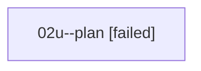

# Family: 02u

[Agent Hoods](../README.md) / [bbugyi200](../users/bbugyi200/README.md) / [athena](../users/bbugyi200/machines/athena/README.md) / [02u](../users/bbugyi200/machines/athena/hoods/02u/README.md) / 02u

Owner: `bbugyi200.athena` · Hood: `02u` · Members: 1

## Lineage

The diagram is an optional enhancement; the ordered table below contains the same lineage in accessible text.

| Role | Agent | State | Model / provider | Timing | Commits | Prompt | Chat |
|---|---|---|---|---|---:|---|---|
| plan | 02u--plan | failed | gpt-5.6-sol / codex | 2026-08-15T19:27:02.876527+00:00 | 0 | [Prompt](../agents/bbugyi200.athena.02u--plan/prompt.md) | [Chat](../agents/bbugyi200.athena.02u--plan/chat.md) |
