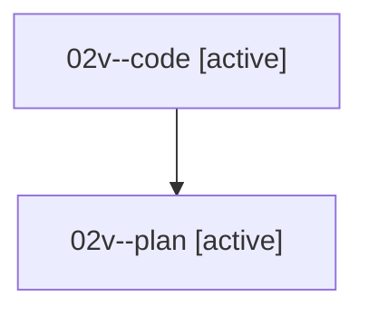

# Family: 02v

[Agent Hoods](../README.md) / [bbugyi200](../users/bbugyi200/README.md) / [athena](../users/bbugyi200/machines/athena/README.md) / [02v](../users/bbugyi200/machines/athena/hoods/02v/README.md) / 02v

Owner: `bbugyi200.athena` · Hood: `02v` · Members: 2

## Lineage

The diagram is an optional enhancement; the ordered table below contains the same lineage in accessible text.

| Role | Agent | State | Model / provider | Timing | Commits | Prompt | Chat |
|---|---|---|---|---|---:|---|---|
| code | 02v--code | active | gpt-5.5 / codex | 2026-08-15T21:37:29.119994+00:00 | [1](../agents/bbugyi200.athena.02v--code/README.md#commits) | — | — |
| plan | 02v--plan | active | gpt-5.6-sol / codex | 2026-08-15T21:02:41.084028+00:00 | 0 | [Prompt](../agents/bbugyi200.athena.02v--plan/prompt.md) | [Chat](../agents/bbugyi200.athena.02v--plan/chat.md) |

## Commits

| Role | Repo | Commit | Subject | Committed |
|---|---|---|---|---|
| — | sase | [`702b82f`](https://github.com/sase-org/sase/commit/702b82f3d5c3a0e5d05ce3420b6a620042b4dddb) | chore: Add SDD prompt and plan for log\_panel\_g\_scroll | 2026-06-20 19:00:09 EDT |
| — | sase | [`de38910`](https://github.com/sase-org/sase/commit/de389106dfc2b89519b96431532a39b474785b22) | feat(tui): add g/G top-bottom scrolling to ACE Logs panel | 2026-06-20 19:07:06 EDT |
| code | sase | [`6f3e51a`](https://github.com/sase-org/sase/commit/6f3e51a137ec3b6142288eb6fa17aa855ea4b952) | fix(bead): preserve active workers during relaunch | 2026-08-15 18:30:30 EDT |
