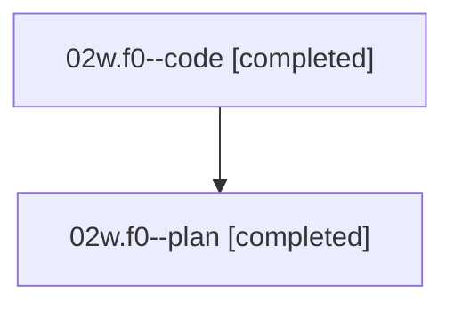

# Family: 02w.f0

[Agent Hoods](../README.md) / [bbugyi200](../users/bbugyi200/README.md) / [athena](../users/bbugyi200/machines/athena/README.md) / [02w](../users/bbugyi200/machines/athena/hoods/02w/README.md) / 02w.f0

Owner: `bbugyi200.athena` · Hood: `02w` · Members: 2

## Lineage

The diagram is an optional enhancement; the ordered table below contains the same lineage in accessible text.

| Role | Agent | State | Model / provider | Timing | Commits | Prompt | Chat |
|---|---|---|---|---|---:|---|---|
| code | 02w.f0--code | completed | sonnet / claude | 2026-08-16T00:02:02.960335+00:00 | [1](../agents/bbugyi200.athena.02w.f0--code/README.md#commits) | — | [Chat](../agents/bbugyi200.athena.02w.f0--code/chat.md) |
| plan | 02w.f0--plan | completed | gpt-5.6-sol / codex | 2026-08-15T23:56:08.655537+00:00 | 0 | [Prompt](../agents/bbugyi200.athena.02w.f0--plan/prompt.md) | [Chat](../agents/bbugyi200.athena.02w.f0--plan/chat.md) |

## Commits

| Role | Repo | Commit | Subject | Committed |
|---|---|---|---|---|
| code | sase | [`57b66a4`](https://github.com/sase-org/sase/commit/57b66a43535b7f7db1abfd5f45284aad44437a80) | feat(ace): add adaptive entry jump to Launch Control | 2026-08-16 01:04:51 UTC |

## Neighbors

| Agent | Relation | State |
|---|---|---|
| [02w](../agents/bbugyi200.athena.02w/README.md) | ancestor | completed |
