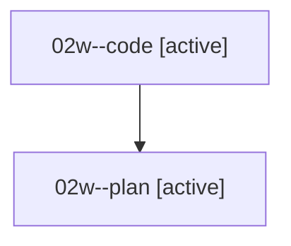

# Family: 02w

[Agent Hoods](../README.md) / [bbugyi200](../users/bbugyi200/README.md) / [athena](../users/bbugyi200/machines/athena/README.md) / [02w](../users/bbugyi200/machines/athena/hoods/02w/README.md) / 02w

Owner: `bbugyi200.athena` · Hood: `02w` · Members: 2

## Lineage

The diagram is an optional enhancement; the ordered table below contains the same lineage in accessible text.

| Role | Agent | State | Model / provider | Timing | Commits | Prompt | Chat |
|---|---|---|---|---|---:|---|---|
| code | 02w--code | active | gpt-5.5 / codex | 2026-08-15T22:55:43.939380+00:00 | 0 | — | — |
| plan | 02w--plan | active | gpt-5.6-sol / codex | 2026-08-15T22:48:59.387049+00:00 | 0 | [Prompt](../agents/bbugyi200.athena.02w--plan/prompt.md) | [Chat](../agents/bbugyi200.athena.02w--plan/chat.md) |

## Commits

| Role | Repo | Commit | Subject | Committed |
|---|---|---|---|---|
| — | sase | [`089c49a`](https://github.com/sase-org/sase/commit/089c49a69e65b51a517baecf6beb8475342e51a9) | chore: Add SDD prompt and plan for startup\_stopwatch\_escalation\_colors | 2026-06-21 08:13:53 EDT |
| — | sase | [`ec8c494`](https://github.com/sase-org/sase/commit/ec8c49412ee66f455c2f55dfcbb605f5d61529c5) | feat(tui): escalate startup stopwatch colors | 2026-06-21 08:22:30 EDT |
