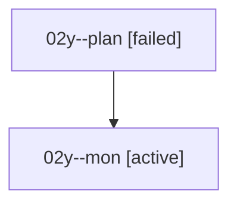

# Family: 02y

[Agent Hoods](../README.md) / [bbugyi200](../users/bbugyi200/README.md) / [athena](../users/bbugyi200/machines/athena/README.md) / [02y](../users/bbugyi200/machines/athena/hoods/02y/README.md) / 02y

Owner: `bbugyi200.athena` · Hood: `02y` · Members: 2

## Lineage

The diagram is an optional enhancement; the ordered table below contains the same lineage in accessible text.

| Role | Agent | State | Model / provider | Timing | Commits | Prompt | Chat |
|---|---|---|---|---|---:|---|---|
| plan | 02y--plan | failed | gpt-5.6-sol / codex | 2026-08-15T23:16:47.385069+00:00 | 0 | [Prompt](../agents/bbugyi200.athena.02y--plan/prompt.md) | [Chat](../agents/bbugyi200.athena.02y--plan/chat.md) |
| mon | 02y--mon | active | gpt-5.6-sol / codex | 2026-08-15T23:25:18.242574+00:00 | 0 | — | — |

## Commits

| Role | Repo | Commit | Subject | Committed |
|---|---|---|---|---|
| — | sase | [`164c0e0`](https://github.com/sase-org/sase/commit/164c0e0ff30ad5cca09aba13047e0e5bdc506409) | chore: Add SDD prompt and plan for agent\_restore\_panel\_polish | 2026-06-21 12:53:31 UTC |
| — | sase | [`6458af0`](https://github.com/sase-org/sase/commit/6458af0ab3cb22321ee8ba2b980a23bc6d5f2e11) | feat(tui): polish agent restore panel rows | 2026-06-21 13:11:06 UTC |

## Neighbors

| Agent | Relation | State |
|---|---|---|
| [02y.f1](../agents/bbugyi200.athena.02y.f1/README.md) | descendant | completed |
