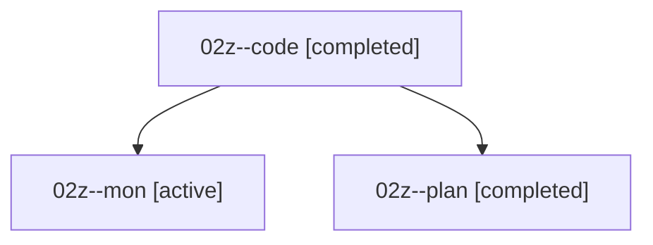

# Family: 02z

[Agent Hoods](../README.md) / [bbugyi200](../users/bbugyi200/README.md) / [athena](../users/bbugyi200/machines/athena/README.md) / [02z](../users/bbugyi200/machines/athena/hoods/02z/README.md) / 02z

Owner: `bbugyi200.athena` · Hood: `02z` · Members: 3

## Lineage

The diagram is an optional enhancement; the ordered table below contains the same lineage in accessible text.

| Role | Agent | State | Model / provider | Timing | Commits | Prompt | Chat |
|---|---|---|---|---|---:|---|---|
| code | 02z--code | completed | gpt-5.5 / codex | 2026-08-15T23:39:45.204719+00:00 | [1](../agents/bbugyi200.athena.02z--code/README.md#commits) | — | [Chat](../agents/bbugyi200.athena.02z--code/chat.md) |
| mon | 02z--mon | active | gpt-5.6-sol / codex | 2026-08-15T23:58:02.248567+00:00 | 0 | — | — |
| plan | 02z--plan | completed | gpt-5.6-sol / codex | 2026-08-15T23:33:39.940559+00:00 | 0 | [Prompt](../agents/bbugyi200.athena.02z--plan/prompt.md) | [Chat](../agents/bbugyi200.athena.02z--plan/chat.md) |

## Commits

| Role | Repo | Commit | Subject | Committed |
|---|---|---|---|---|
| — | sase | [`1f4c5a7`](https://github.com/sase-org/sase/commit/1f4c5a7aabacac7083ebbf971160fa33ba2e6cb6) | chore: Add SDD prompt and plan for exclude\_default\_vcs\_mru | 2026-06-21 09:00:38 EDT |
| — | sase | [`c2b53bc`](https://github.com/sase-org/sase/commit/c2b53bc35bd592360159f543a676f1959b45a987) | feat(tui): exclude default VCS xprompt from prompt cycling | 2026-06-21 09:08:34 EDT |
| code | sase | [`ca60019`](https://github.com/sase-org/sase/commit/ca600192c528f43faf59cecec8fdac0c777f38df) | fix: avoid artifact lock for tribe-only updates | 2026-08-15 19:59:09 EDT |

## Neighbors

| Agent | Relation | State |
|---|---|---|
| [02z.f1](../agents/bbugyi200.athena.02z.f1/README.md) | descendant | completed |
