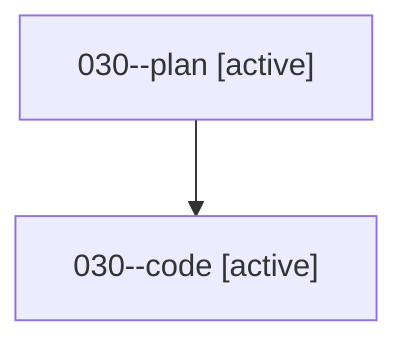

# Family: 030

[Agent Hoods](../README.md) / [bbugyi200](../users/bbugyi200/README.md) / [athena](../users/bbugyi200/machines/athena/README.md) / [030](../users/bbugyi200/machines/athena/hoods/030/README.md) / 030

Owner: `bbugyi200.athena` · Hood: `030` · Members: 2

## Lineage

The diagram is an optional enhancement; the ordered table below contains the same lineage in accessible text.

| Role | Agent | State | Model / provider | Timing | Commits | Prompt | Chat |
|---|---|---|---|---|---:|---|---|
| plan | 030--plan | active | gpt-5.6-sol / codex | 2026-08-15T23:44:30.707006+00:00 | 0 | [Prompt](../agents/bbugyi200.athena.030--plan/prompt.md) | [Chat](../agents/bbugyi200.athena.030--plan/chat.md) |
| code | 030--code | active | grok-4.6 / grok | 2026-08-15T23:50:07.325571+00:00 | 0 | — | — |

## Commits

| Role | Repo | Commit | Subject | Committed |
|---|---|---|---|---|
| — | sase | [`5d42565`](https://github.com/sase-org/sase/commit/5d4256583da308c61d27fbc72417c48d49ffd4ed) | chore: Add SDD prompt and plan for reverted\_agent\_indicator | 2026-06-21 09:49:44 EDT |
| — | sase | [`c949acf`](https://github.com/sase-org/sase/commit/c949acf56bbc8d225c5020c6538f2cf53042707c) | feat(tui): indicate reverted agents | 2026-06-21 09:59:03 EDT |
