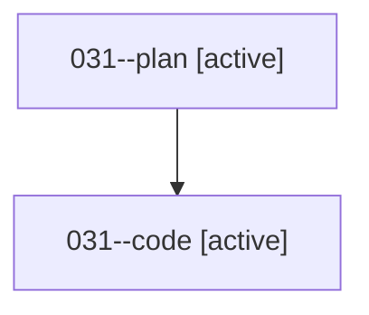

# Family: 031

[Agent Hoods](../README.md) / [bbugyi200](../users/bbugyi200/README.md) / [athena](../users/bbugyi200/machines/athena/README.md) / [031](../users/bbugyi200/machines/athena/hoods/031/README.md) / 031

Owner: `bbugyi200.athena` · Hood: `031` · Members: 2

## Lineage

The diagram is an optional enhancement; the ordered table below contains the same lineage in accessible text.

| Role | Agent | State | Model / provider | Timing | Commits | Prompt | Chat |
|---|---|---|---|---|---:|---|---|
| plan | 031--plan | active | gpt-5.6-sol / codex | 2026-08-15T23:50:02.243753+00:00 | 0 | [Prompt](../agents/bbugyi200.athena.031--plan/prompt.md) | [Chat](../agents/bbugyi200.athena.031--plan/chat.md) |
| code | 031--code | active | gpt-5.5 / codex | 2026-08-15T23:53:09.667670+00:00 | 0 | — | — |

## Commits

| Role | Repo | Commit | Subject | Committed |
|---|---|---|---|---|
| — | sase | [`dd91764`](https://github.com/sase-org/sase/commit/dd91764759a45aec274a7d2657e46f87b591e8ba) | chore: Add SDD prompt and plan for prompt\_search\_char\_targets | 2026-06-21 09:45:35 EDT |
| — | sase | [`838bf81`](https://github.com/sase-org/sase/commit/838bf81ed1051cb0e67ba68341a51e0b2bca01c9) | fix(tui): keep \`/\` and \`?\` as literal char targets in prompt NORMAL mode | 2026-06-21 09:55:52 EDT |
