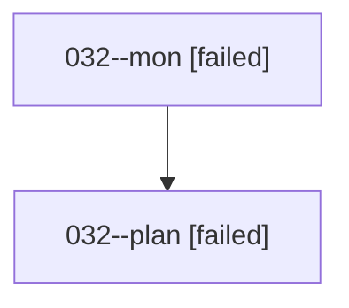

# Family: 032

[Agent Hoods](../README.md) / [bbugyi200](../users/bbugyi200/README.md) / [athena](../users/bbugyi200/machines/athena/README.md) / [032](../users/bbugyi200/machines/athena/hoods/032/README.md) / 032

Owner: `bbugyi200.athena` · Hood: `032` · Members: 2

## Lineage

The diagram is an optional enhancement; the ordered table below contains the same lineage in accessible text.

| Role | Agent | State | Model / provider | Timing | Commits | Prompt | Chat |
|---|---|---|---|---|---:|---|---|
| mon | 032--mon | failed | opus / claude | 2026-08-16T00:25:22.738415+00:00 | 0 | — | [Chat](../agents/bbugyi200.athena.032--mon/chat.md) |
| plan | 032--plan | failed | opus / claude | 2026-08-16T00:13:33.490344+00:00 | 0 | [Prompt](../agents/bbugyi200.athena.032--plan/prompt.md) | [Chat](../agents/bbugyi200.athena.032--plan/chat.md) |

## Commits

| Role | Repo | Commit | Subject | Committed |
|---|---|---|---|---|
| — | sase | [`79b7577`](https://github.com/sase-org/sase/commit/79b757799008f229fa9af68293b8038b998edc84) | chore: Add SDD prompt and plan for snippet\_reference\_syntax | 2026-06-21 10:22:46 EDT |
| — | sase | [`4dc06e9`](https://github.com/sase-org/sase/commit/4dc06e92d9795577b061c287af940b6147d51c64) | feat: support snippet reference syntax | 2026-06-21 10:40:29 EDT |
