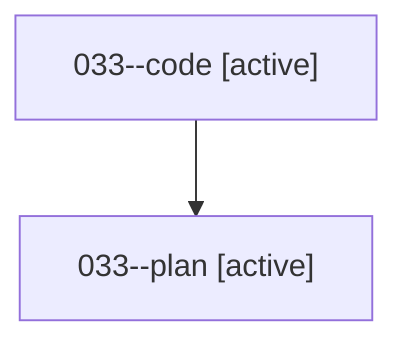

# Family: 033

[Agent Hoods](../README.md) / [bbugyi200](../users/bbugyi200/README.md) / [athena](../users/bbugyi200/machines/athena/README.md) / [033](../users/bbugyi200/machines/athena/hoods/033/README.md) / 033

Owner: `bbugyi200.athena` · Hood: `033` · Members: 2

## Lineage

The diagram is an optional enhancement; the ordered table below contains the same lineage in accessible text.

| Role | Agent | State | Model / provider | Timing | Commits | Prompt | Chat |
|---|---|---|---|---|---:|---|---|
| code | 033--code | active | sonnet / claude | 2026-08-16T00:26:05.542808+00:00 | 0 | — | — |
| plan | 033--plan | active | gpt-5.6-sol / codex | 2026-08-16T00:20:10.750459+00:00 | 0 | [Prompt](../agents/bbugyi200.athena.033--plan/prompt.md) | [Chat](../agents/bbugyi200.athena.033--plan/chat.md) |
