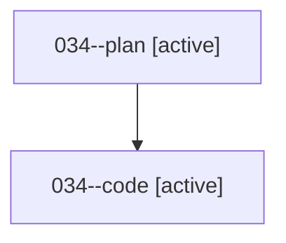

# Family: 034

[Agent Hoods](../README.md) / [bbugyi200](../users/bbugyi200/README.md) / [athena](../users/bbugyi200/machines/athena/README.md) / [034](../users/bbugyi200/machines/athena/hoods/034/README.md) / 034

Owner: `bbugyi200.athena` · Hood: `034` · Members: 2

## Lineage

The diagram is an optional enhancement; the ordered table below contains the same lineage in accessible text.

| Role | Agent | State | Model / provider | Timing | Commits | Prompt | Chat |
|---|---|---|---|---|---:|---|---|
| plan | 034--plan | active | opus / claude | 2026-08-16T00:24:17.207656+00:00 | 0 | [Prompt](../agents/bbugyi200.athena.034--plan/prompt.md) | [Chat](../agents/bbugyi200.athena.034--plan/chat.md) |
| code | 034--code | active | sonnet / claude | 2026-08-16T00:39:55.213089+00:00 | [1](../agents/bbugyi200.athena.034--code/README.md#commits) | — | — |

## Commits

| Role | Repo | Commit | Subject | Committed |
|---|---|---|---|---|
| code | sase | [`233d624`](https://github.com/sase-org/sase/commit/233d6246332cec09b875b8c14b1c27215622c349) | fix(ace): keep launch-default indicator live as the @large pool rotates | 2026-08-16 01:09:18 UTC |

## Neighbors

| Agent | Relation | State |
|---|---|---|
| [034.cdx](../agents/bbugyi200.athena.034.cdx/README.md) | descendant | completed |
